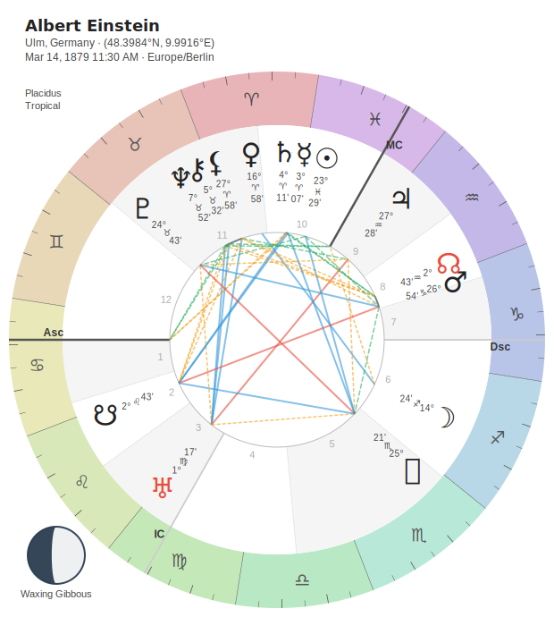
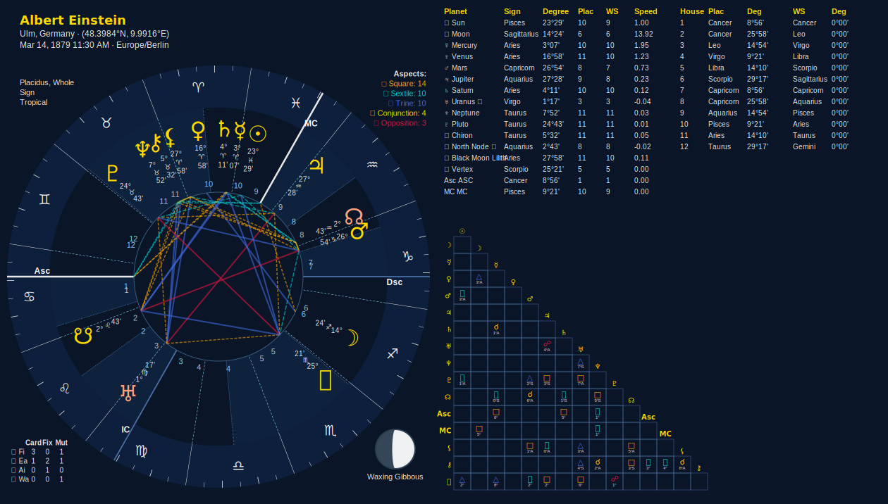
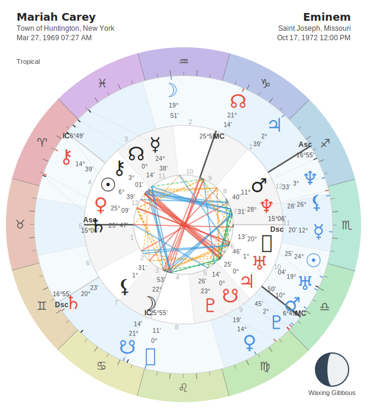
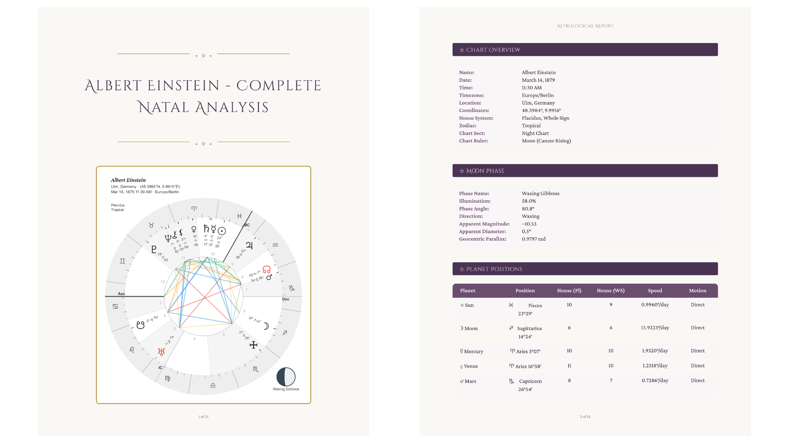
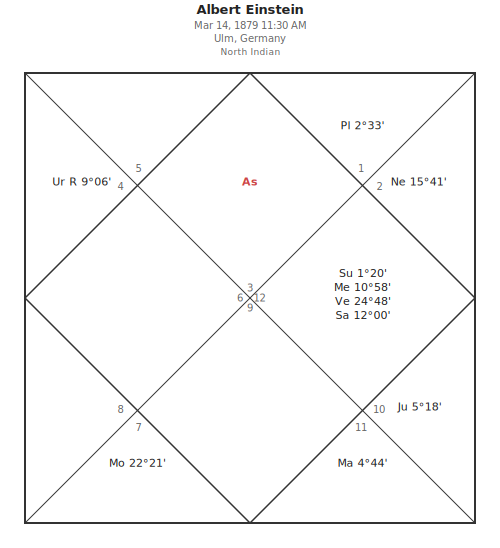
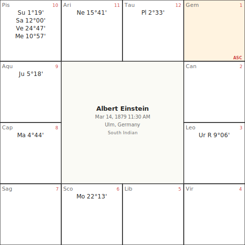
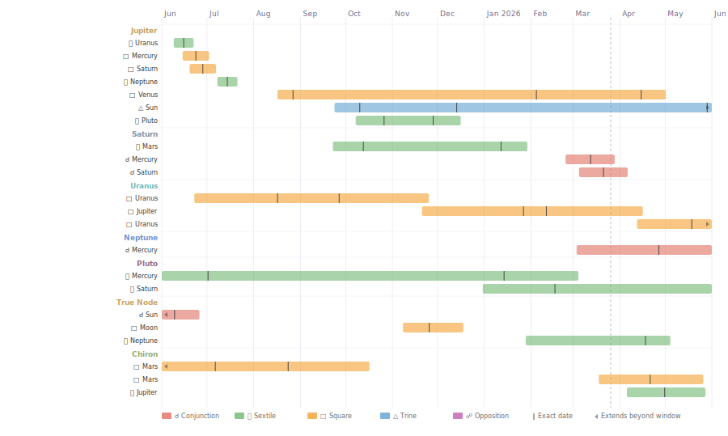
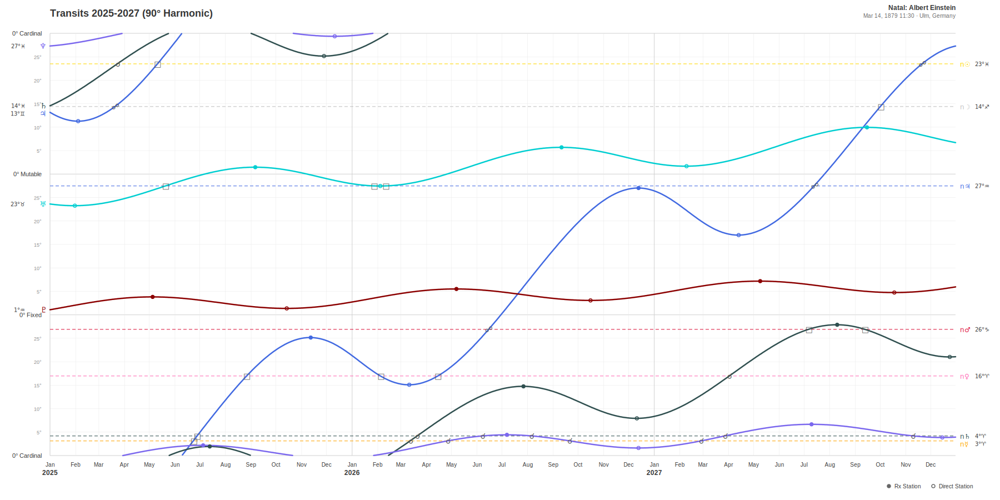
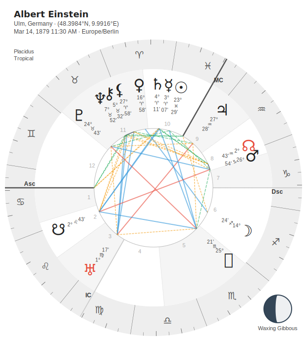
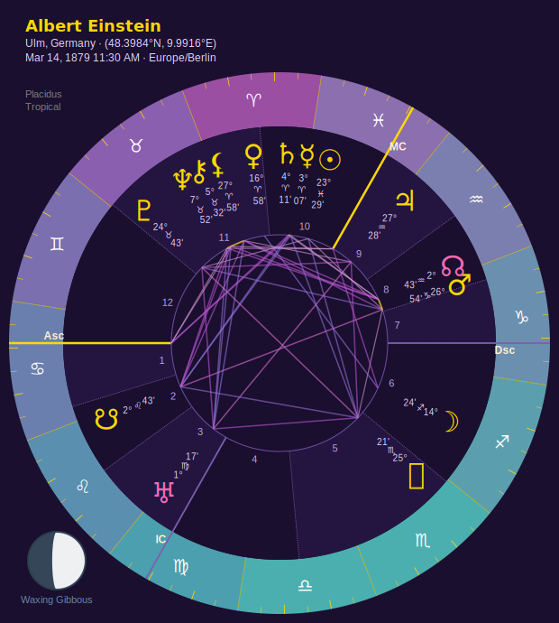

# 🌟 Stellium

[](https://badge.fury.io/py/stellium)
[](https://pypi.org/project/stellium/)
[](https://opensource.org/license/agpl-3-0)
[](https://github.com/katelouie/stellium)
[](https://github.com/katelouie/stellium/actions/workflows/tests.yml)
[](https://deepwiki.com/katelouie/stellium)
[](https://github.com/astral-sh/ruff)
[](https://stellium.readthedocs.io/en/latest/?badge=latest)

**A modern, extensible Python library for computational astrology**

Built on Swiss Ephemeris for NASA-grade astronomical accuracy, Stellium brings professional astrological calculations to Python with a clean, composable architecture that works for everyone, from quick scripts to production applications.

Read the extensive documentation and API autodocs at [Read The Docs](https://stellium.readthedocs.io/en/latest/).

**Try out some quick examples immediately, no installation needed:** [](https://colab.research.google.com/github/katelouie/stellium/blob/main/examples/stellium_sampler_colab.ipynb)

**Stellium The Webapp is live! [Visit it here!](https://www.stelliumastro.app/)** It represents about 50-60% of the functionality of the full package, but is great for testing out the core capabilities and getting quick chart outputs.

*Star the repo if you find it useful!* ⭐

---

## Why Stellium?

### **For Python Developers**

- **Fully typed** with modern type hints for excellent IDE support
- **Protocol-driven architecture** - extend with custom engines, no inheritance required
- **Fluent builder pattern** - chainable, readable, intuitive API
- **Flexible input formats** - accepts datetime strings, city names, or precise coordinates
- **Modular & composable** - mix and match components as needed
- **Production-ready** with comprehensive test coverage

If you've used React (composable, plug-and-play components) or PyTorch (sensible defaults, progressive disclosure, lazy `.calculate()`), the API should feel familiar.

### **For Astrologers**

**Western:**

- **Large-scale data analysis** with pandas DataFrames, batch calculation, and statistical tools
- **23+ house systems** including Placidus, Whole Sign, Koch, Equal, Regiomontanus, and more (see the [full list](docs/options_list.md)).
- **Multiple house systems in a single chart** for comparison of traditions and meta-analysis
- **Declination calculations** with out-of-bounds planet detection and parallel/contraparallel aspects
- **Bi-, tri- and quad-wheel charts** for synastry, transits, progressions, returns, arc directions, and composite analysis
- **Sect-aware calculations** with proper day/night chart handling
- **Birth-time rectification (sect)** — honest, human-in-the-loop recovery of day/night **sect** (~70%, cross-validated) via a compare-hypothesis workbench; deliberately does *not* fake minute-level time (it's an ill-posed inverse). [Guide](docs/astrology/RECTIFICATION.md)
- **25+ Arabic Parts** with traditional formulas (see the [full list](docs/options_list.md))
- **Essential & accidental dignity scoring** for both traditional and modern rulerships
- **Fixed stars** — the four Royal Stars and beyond, by tier or by name (e.g. Regulus, Algol)
- **Chart rulership and profections** for traditional astrology
- **Dispositor graphs** for planets and (experimentally) houses in reports
- **Aspect pattern detection** - Grand Trines, T-Squares, Yods, Stelliums, and more
- **Zodiacal Releasing** for 25+ lots (including Fortune and Spirit) and optional "fractal" calculation mode
- **Firdaria** — the Persian time-lord system with day/night sequencing, seven Chaldean sub-periods, and Abu Ma'shar / Bonatti node presets
- **Length of life** — the classical hyleg → alcocoden years-table (Lilly) with a fully itemized, auditable result, plus a reusable almuten-of-a-degree calculator
- **Uranian astrology** including Trans-Neptunian Planets and 45/90/360-degree dials with pointers.
- **Primary and Zodiacal directions** with 3D modeling and and distribution across bounds
- **Draconic Charts and Void of Course Moon**
- **Transit timeline analysis** - Calculate transit-to-natal aspect periods with orb entry/exit windows, retrograde multi-pass detection, plain-text list output, and SVG Gantt chart visualization
- **Prompt-friendly text export** - `chart.to_prompt_text()` generates clean markdown from any chart type, ready for LLM prompts. Handles single charts, synastry, composites, unknown-time charts, multiple house systems, and all components
- **Electional astrology** - Find auspicious times with 30+ predicates, interval optimization, and planetary hours
- **Heliocentric positions**
- **Antiscia and contra-antiscia** with a dedicated report section
- **Beautiful visualizations** with professional SVG chart rendering and 13 themes
- **Beautiful Composable PDF or CLI reports** to show nitty-gritty details of the chart (see [this example](examples/reports/einstein_complete_report.pdf) for a subset of what's available)
- **Localized reports** — render terminal, Markdown, HTML, and PDF reports in multiple languages (Simplified Chinese included) via `with_locale()`
- **Notable births database** for quick exploration and learning. [Check out the current list](data/notables/INDEX.md)
- **Notable life-event & temperament datasets** — taxonomy-tagged biographical timelines (888 dated events) and character descriptors for 60+ notables, honestly provenance-graded, via `get_notable_life_events()` / `get_notable_temperament()`

**Vedic:**

- **Both tropical and sidereal zodiacs** with 9 ayanamsa systems for Vedic astrology
- **North Indian and South Indian chart rendering** — traditional Vedic/Jyotish chart formats with 3 themes, 4 label styles, degree display, and full native info

**Chinese:**

- Ba Zi system with Ten Gods and Hidden Stems

### Visual Chart Example




### Synastry



### Report Sample Pages



### Vedic Charts (North Indian & South Indian)




### Transit Timeline (Gantt Chart)



### Graphic Ephemeris Example



### **What Makes Stellium Different**

Unlike other Python astrology libraries, Stellium is designed for **extensibility**:

```python
# Other libraries: rigid, hard-coded calculations
chart = AstrologyLibrary(date, location)  # That's all you can do

# Stellium: composable, configurable, extensible
chart = (ChartBuilder.from_details("2000-01-06 12:00", "Seattle, WA")
    .with_house_systems([PlacidusHouses(), WholeSignHouses()])  # Multiple systems!
    .with_sidereal("lahiri")                                    # Sidereal zodiac option
    .with_aspects(ModernAspectEngine())                         # Swap aspect engines
    .with_orbs(LuminariesOrbEngine())                          # Custom orb rules
    .add_component(ArabicPartsCalculator())                    # Plugin-style components
    .add_component(MidpointCalculator())                       # Stack as many as you want
    .calculate())                                              # Lazy evaluation
```

- **Performance** - Advanced caching system makes repeated calculations fast
- **Flexibility** - Calculate multiple house systems simultaneously
- **Accuracy** - Swiss Ephemeris provides planetary positions accurate to fractions of an arc-second
- **Modern Python** - Takes full advantage of Python 3.11+ features

---

## Installation

```bash
pip install stellium
```

### Requirements

- Python 3.11 or higher
- All dependencies installed automatically (pyswisseph, pytz, geopy, rich, svgwrite)
- *Note: On Python 3.12+, installing requires a C toolchain (until `pyswisseph` ships newer wheels)*

### Optional Dependencies

```bash
# For data analysis with pandas DataFrames
pip install stellium[analysis]
```

---

## Quick Start

### Your First Chart (2 Lines of Code)

```python
from stellium import ChartBuilder

chart = ChartBuilder.from_notable("Albert Einstein").with_aspects().calculate()
chart.draw("einstein.svg").save()
```



**That's it!** You now have a beautiful natal chart SVG for Einstein.

The `from_notable()` factory method uses our curated database of famous births. Other notables include: "Carl Jung", "Frida Kahlo", "Marie Curie", and more. [Check out the current list](data/notables/INDEX.md).

### Beautiful Visualizations, Zero Config

Want to customize your chart? The fluent `.draw()` API makes it effortless:

```python
# Apply a preset for instant results
chart.draw("detailed.svg").preset_detailed().save()

# Choose a theme
chart.draw("midnight.svg").with_theme("midnight").save()

# Full customization
chart.draw("custom.svg") \
    .with_theme("celestial") \
    .with_zodiac_palette("rainbow_celestial") \
    .with_moon_phase(position="bottom-left", show_label=True) \
    .with_chart_info(position="top-left") \
    .save()
```



**Discover features through autocomplete!** Type `chart.draw().` and your IDE will show you everything available.

📚 **See the [Visualization Guide](docs/VISUALIZATION.md) for complete documentation, theme gallery, and examples.**

### Your Own Chart

```python
from stellium import ChartBuilder

# Quick method: just pass datetime string and location
chart = ChartBuilder.from_details(
    "2000-01-06 12:00",  # ISO format, US format, or European format
    "Seattle, WA"        # City name or (lat, lon) tuple
).with_aspects().calculate()

# Access planetary positions
sun = chart.get_object("Sun")
print(sun)

moon = chart.get_object("Moon")
print(moon)
print(moon.phase)
```

```sh
Sun: 0°0' Libra (180°)
Moon: 0°0' Aries (0°)
Phase: Full (100% illuminated)
```

**Key Features:**

- **Flexible datetime parsing**: ISO 8601, US format, European format, or date-only
- **Automatic geocoding**: City name → coordinates
- **Automatic timezone handling**: Naive datetimes converted to UTC
- **Smart defaults**: Placidus houses, major (Ptolemaic) aspects, tropical zodiac

---

## Progressive Examples

### Level 1: Exploring Chart Data

```python
from stellium import ChartBuilder

# Modern convenience method - accepts datetime strings!
chart = ChartBuilder.from_details("2000-01-06 12:00", "Seattle, WA").with_aspects().calculate()

# Get all planets
for planet in chart.get_planets():
    print(f"{planet.name}: {planet.longitude:.2f}° {planet.sign}")

# Get aspects
for aspect in chart.aspects:
    print(f"{aspect.object1.name} {aspect.aspect_name} {aspect.object2.name} (orb: {aspect.orb:.2f}°)")

# Get house cusps
houses = chart.get_houses()  # Returns HouseCusps for default (or first) system
for i, cusp in enumerate(houses.cusps, 1):
    print(f"House {i}: {cusp:.2f}°")
```

### Level 2: Custom House Systems & Aspects

```python
from stellium import ChartBuilder
from stellium.engines import WholeSignHouses, ModernAspectEngine, SimpleOrbEngine

chart = (ChartBuilder.from_details("2000-01-06 12:00", "Seattle, WA")
    .with_house_systems([WholeSignHouses()])  # Use Whole Sign houses
    .with_aspects(ModernAspectEngine())       # Explicit aspect engine
    .with_orbs(SimpleOrbEngine())             # Simple orb rules
    .calculate())

print(f"House System: {chart.default_house_system}")

# Access house cusps for the specific system
whole_sign_cusps = chart.get_houses("Whole Sign")
print(whole_sign_cusps.get_description(1))  # First House
```

**Available House Systems:**
Placidus (default), Whole Sign, Koch, Equal, Regiomontanus, Campanus, Porphyry, Alcabitius, Equal (MC), Vehlow Equal, Topocentric, Morinus, and 11+ more.

### Level 3: Multiple House Systems

```python
from stellium import ChartBuilder
from stellium.engines import PlacidusHouses, WholeSignHouses, KochHouses

chart = (ChartBuilder.from_details("2000-01-06 12:00", "Seattle, WA")
    .with_house_systems([
        PlacidusHouses(),
        WholeSignHouses(),
        KochHouses()
    ])
    .calculate())

# Access each system independently
print(f"Sun in Placidus House: {chart.get_house('Sun', 'Placidus')}")

# House placements are tracked per-system
print(f"Sun in Whole Sign House: {chart.get_house('Sun', 'Whole Sign')}")

print(f"Sun in Koch House: {chart.get_house('Sun', 'Koch')}")
```

### Level 4: Arabic Parts & Components

```python
from stellium import ChartBuilder
from stellium.components import ArabicPartsCalculator, MidpointCalculator

chart = (ChartBuilder.from_details("2000-01-06 12:00", "Seattle, WA")
    .add_component(ArabicPartsCalculator())
    .add_component(MidpointCalculator())
    .calculate())

# Arabic Parts (automatically sect-aware)
arabic_parts = chart.get_component_result("Arabic Parts")
for part in arabic_parts:
    print(f"{part.name:25} {part.longitude:6.2f}° {part.sign:12} House {chart.get_house(part.name)}")

# Midpoints
midpoints = chart.get_component_result("Midpoints")
for mp in midpoints[:5]:  # First 5 midpoints
    print(f"{mp.object1.name}/{mp.object2.name} midpoint: {mp.longitude:.2f}°")
```

**Available Components:**

- `ArabicPartsCalculator` - 25+ traditional lots (Part of Fortune, Spirit, Love, etc.)
- `MidpointCalculator` - Direct midpoints for all planet pairs
- `DignityComponent` - Essential dignities (rulership, exaltation, triplicity, etc.)
- `AspectPatternAnalyzer` - Detect Grand Trines, T-Squares, Yods, Stelliums, etc.

### Level 5: Terminal Reports with Rich

```python
from stellium import ChartBuilder, Native, ReportBuilder
from stellium.components import DignityComponent
from stellium.engines.patterns import AspectPatternAnalyzer
from datetime import datetime

native = Native(datetime(2000, 1, 6, 12, 00), "Seattle, WA")
chart = (ChartBuilder.from_native(native)
    .with_aspects()
    .add_component(DignityComponent())
    .add_analyzer(AspectPatternAnalyzer())
    .calculate())

# Build a comprehensive terminal report
report = (ReportBuilder()
    .from_chart(chart)
    .with_chart_overview()                    # Chart metadata (date, location, zodiac system)
    .with_planet_positions(house_systems="all")  # Positions with ALL house systems
    .with_declinations()                      # Declination table with OOB detection
    .with_house_cusps(systems="all")          # House cusps for all systems
    .with_aspects(mode="major")               # Major aspects table
    .with_aspect_patterns()                   # Grand Trines, T-Squares, Yods, etc.
    .with_dignities(essential="both"))        # Essential dignities (traditional + modern)

report.render(format="rich_table")  # Beautiful terminal output

# Export to file
report.render(format="plain_table", file="my_chart.txt")
report.render(format="pdf", file="my_chart.pdf")  # PDF with Typst
```

### Level 6: Advanced - Bi-Wheel Charts

```python
from stellium import MultiChartBuilder

# Synastry chart (relationship analysis)
synastry = MultiChartBuilder.synastry(
    ("1994-01-06 11:47", "Palo Alto, CA"),
    ("1995-06-15 14:30", "Seattle, WA"),
    label1="Kate",
    label2="Alex",
).calculate()

# Draw bi-wheel with both charts
synastry.draw("synastry_biwheel.svg") \
    .preset_detailed() \
    .save()

# Access inner and outer charts separately
inner_chart = synastry.inner
outer_chart = synastry.outer

# Get cross-chart aspects
cross_aspects = synastry.get_cross_aspects()
for aspect in cross_aspects[:10]:
    print(f"{aspect.object1.name} ({synastry.labels[0]}) "
          f"{aspect.aspect_name} "
          f"{aspect.object2.name} ({synastry.labels[1]})")
```

**Comparison Chart Types:**

- **Synastry**: Relationship compatibility and dynamics
- **Transit**: Current planetary influences on natal chart
- **Progression**: Secondary progressions for timing
- **Composite**: Relationship midpoint chart (synthesis)
- **Davison**: Relationship chart with actual location

---

## Command-Line Interface

Stellium includes a CLI for quick chart generation:

```bash
# Generate a chart from the notable database
stellium chart notable "Albert Einstein" --output einstein.svg

# Manage ephemeris data
stellium ephemeris download --years 1000-3000

# Clear calculation cache
stellium cache clear
```

See `stellium --help` for full CLI documentation.

---

## Ephemeris Data Location

Stellium bundles enough Swiss Ephemeris data to cover **1800–2999 CE** and
automatically copies it to `~/.stellium/ephe/` on first use, so most users
never need to download anything. Use `stellium ephemeris download` if you
need coverage outside that range or extra asteroid files.

### Using a custom ephemeris directory

You can point Stellium at any existing Swiss Ephemeris folder — handy for
portable installs, read-only home directories (Docker, Lambda, shared
hosts), or for reusing a folder you already maintain for another astrology
tool. Two options, in order of precedence:

```python
# 1. Explicit argument wins over everything else
from stellium import ChartBuilder
from stellium.engines.ephemeris import SwissEphemerisEngine

chart = (ChartBuilder.from_native(native)
    .with_ephemeris(SwissEphemerisEngine(ephe_path=r"D:\swisseph\ephe"))
    .calculate())
```

```bash
# 2. Environment variable — no code changes required
export STELLIUM_EPHE_PATH=/opt/swisseph/ephe       # macOS / Linux
set STELLIUM_EPHE_PATH=D:\swisseph\ephe            # Windows (cmd)
$env:STELLIUM_EPHE_PATH = "D:\swisseph\ephe"       # Windows (PowerShell)
```

When you supply a custom path Stellium uses it **as-is**: the folder is not
created, and the bundled ephemeris files are **not** copied into it.
Make sure it already contains every `.se1` file you need for the objects
and date range you plan to calculate.

---

## Feature Highlights

### Zodiac Systems

- **Tropical Zodiac** (Western astrology) - default
- **Sidereal Zodiac** (Vedic/Hindu astrology) with 9 ayanamsa systems:
  - Lahiri (default for sidereal)
  - Fagan-Bradley
  - Raman
  - Krishnamurti
  - Yukteshwar
  - J.N. Bhasin
  - True Chitrapaksha
  - True Revati
  - De Luce

```python
# Tropical (default)
chart = ChartBuilder.from_native(native).calculate()

# Sidereal with Lahiri ayanamsa
chart = ChartBuilder.from_native(native).with_sidereal("lahiri").calculate()

# Sidereal with custom ayanamsa
chart = ChartBuilder.from_native(native).with_sidereal("fagan_bradley").calculate()
```

### Celestial Objects

Calculate positions for 50+ celestial objects:

- **Planets**: Sun, Moon, Mercury, Venus, Mars, Jupiter, Saturn, Uranus, Neptune, Pluto
- **Asteroids**: Chiron, Ceres, Pallas, Juno, Vesta
- **Lunar Nodes**: North Node, South Node, True Node, Mean Node
- **Lunar Apogee**: Lilith (Mean, True, Osculating, Interpolated)
- **Chart Points**: Ascendant, Midheaven, Descendant, IC, Vertex, East Point

### Coordinate Systems

- **Ecliptic Coordinates**: Longitude, latitude (distance from ecliptic)
- **Equatorial Coordinates**: Right ascension, declination (distance from celestial equator)
- **Out-of-Bounds Detection**: Automatically identifies planets with extreme declinations (>23°27')

```python
sun = chart.get_object("Sun")
print(f"Ecliptic: {sun.longitude:.2f}° longitude, {sun.latitude:.2f}° latitude")
print(f"Equatorial: {sun.right_ascension:.2f}° RA, {sun.declination:.2f}° declination")
if sun.is_out_of_bounds:
    print(f"⚠ Sun is out of bounds!")
```

### Aspect Calculations

- **Major Aspects** (Ptolemaic): Conjunction (0°), Opposition (180°), Square (90°), Trine (120°), Sextile (60°)
- **Minor Aspects**: Semi-sextile (30°), Semi-square (45°), Sesquiquadrate (135°), Quincunx (150°)
- **Harmonic Aspects**: Quintile (72°), Bi-quintile (144°), Septile (51.43°), Novile (40°), and more
- **Configurable Orbs**: Simple, Luminaries-specific, or Complex (aspect-and-planet-pair-specific) orb engines

### Dignities

- **Essential Dignities**: Ruler, Exaltation, Triplicity (by sect), Bound, Decan, Detriment, Fall
- **Accidental Dignities**: House placement, angular/succedent/cadent, joy
- **Both Traditional & Modern** rulerships supported

### Comparison Charts (Bi-Wheels)

Create relationship, timing, and synthesis charts:

```python
from stellium import MultiChartBuilder, Native, SynthesisBuilder

# Synastry (relationship analysis)
synastry = MultiChartBuilder.synastry(
    ("1994-01-06 11:47", "Palo Alto, CA"),
    ("1995-06-15 14:30", "Seattle, WA"),
    label1="Person A",
    label2="Person B",
).calculate()
synastry.draw("synastry.svg").save()

# Transits (timing analysis)
transits = MultiChartBuilder.transit(
    natal_data=("1994-01-06 11:47", "Palo Alto, CA"),
    transit_data=("2025-11-26 12:00", "Palo Alto, CA"),
).calculate()

# Composite (relationship midpoint chart)
native_a = Native("1994-01-06 11:47", "Palo Alto, CA")
native_b = Native("1995-06-15 14:30", "Seattle, WA")
composite = SynthesisBuilder.composite(native_a, native_b).calculate()

# Davison (relationship midpoint chart with actual location)
davison = SynthesisBuilder.davison(native_a, native_b).calculate()
```

**Comparison Types:**

- **Synastry**: Two natal charts overlaid (bi-wheel)
- **Transit**: Natal chart + current/future planets
- **Progression**: Natal chart + progressed positions
- **Composite**: Midpoint chart (mathematical average)
- **Davison**: Midpoint chart with actual geographic location

### Unknown Birth Time Charts

Handle charts when birth time is unknown:

```python
# Create chart with unknown time (defaults to noon, skips houses/angles)
chart = ChartBuilder.from_details(
    "1994-01-06",  # Date only
    "Palo Alto, CA",
    time_unknown=True
).calculate()

# Visualize with Moon's daily arc
chart.draw("unknown_time.svg").save()  # Shows Moon's possible range
```

### Birth-Time Rectification (Sect)

Recover the one thing that *is* recoverable from an unknown birth time — **sect**
(day vs night) — at ~70% accuracy (cross-validated). It's a single honest call, and
an *indicator, not an oracle*: Stellium deliberately refuses to invent a
minute-level time (the inverse is ill-posed). See the **[Rectification Guide](docs/astrology/RECTIFICATION.md)**
for what it does, and — importantly — how *not* to use it.

```python
from stellium import ChartBuilder, analyze_sect

chart = ChartBuilder.from_notable("Frida Kahlo").calculate()
a = analyze_sect(chart)                       # events auto-looked-up for notables
print(f"{a.p_day:.2f} → {a.leans}")           # 0.80 → day

# Or as a report section (renders in every format):
from stellium import ReportBuilder
ReportBuilder().from_chart(chart).with_sect_rectification().render(format="markdown")
```

### Data Export

```python
# Export to dictionary for JSON serialization
data = chart.to_dict()

# Includes:
# - All planetary positions with coordinates
# - House cusps for all calculated systems
# - All aspects with orbs
# - Component results (Arabic Parts, midpoints, etc.)
# - Chart metadata (date, location, timezone)
```

### PDF Planner Generation

Generate beautiful personalized astrological planners as PDF files:

```python
from stellium import Native, PlannerBuilder

native = Native("1990-05-15 14:30", "San Francisco, CA")

planner = (
    PlannerBuilder.for_native(native)
    .year(2025)
    .timezone("America/Los_Angeles")
    .with_natal_chart()
    .with_solar_return()
    .with_graphic_ephemeris(harmonic=90)
    .include_natal_transits()  # All planets + Node + Chiron
    .include_moon_phases()
    .include_voc(mode="traditional")
    .generate("my_planner.pdf")
)
```

**Planner Features:**

- **Front matter pages**: Natal chart, progressed chart, solar return, annual profection, graphic ephemeris
- **Monthly calendar grids**: Full-page calendar view with all events displayed
- **Weekly detail pages**: 7-day spreads with compact event listings
- **Daily events**: Transit-to-natal aspects, Moon phases, VOC periods, ingresses, stations, eclipses
- **Configurable**: Week start (Sunday/Monday), page size (A4/Letter), binding margins

Requires: `pip install typst`

See the [planner cookbook](examples/planner_cookbook.py) for detailed recipes.

### Chart Atlas PDF Generation

Generate multi-page PDF documents with one chart per page, like an old-school astrologer's chart atlas:

```python
from stellium.visualization.atlas import AtlasBuilder
from stellium.core.native import Native
from datetime import datetime

# Create an atlas from notables
(AtlasBuilder()
    .add_notable("Albert Einstein")
    .add_notable("Marie Curie")
    .add_notable("Isaac Newton")
    .with_title_page("Famous Scientists")
    .with_header()
    .with_theme("midnight")
    .save("scientists_atlas.pdf"))

# Or with Uranian dials
native1 = Native(datetime(1994, 1, 6, 11, 47), "Palo Alto, CA")
native2 = Native(datetime(1995, 6, 15, 14, 30), "Seattle, WA")
native3 = Native(datetime(2000, 3, 20, 8, 0), "Portland, OR")
(AtlasBuilder()
    .add_natives([native1, native2, native3])
    .with_chart_type("dial", degrees=90)
    .save("uranian_atlas.pdf"))

# Generate atlas from entire notables database
AtlasBuilder.from_all_notables().save("complete_atlas.pdf")

# Filter by category and sort by birth date
AtlasBuilder.from_all_notables(category="scientist", sort_by="date").save("scientists.pdf")
```

**Atlas Features:**

- **Multiple input methods**: Add natives directly, look up notables by name, or use `from_all_notables()` for the entire database
- **Category filtering**: Filter notables by category (scientist, artist, etc.) and sort by name or date
- **Chart types**: Natal wheels or Uranian dials (90°, 45°, 360°)
- **Configurable**: Headers, themes, page sizes (Letter, A4, half-letter)
- **Title page**: Optional title page for the atlas

Requires: `pip install typst`

### Data Analysis (pandas Integration)

Batch calculate charts and analyze with pandas DataFrames:

```python
from stellium.analysis import BatchCalculator, ChartStats, charts_to_dataframe

# Calculate 100s of charts from the notables database
charts = BatchCalculator.from_registry(category="scientist").calculate_all()

# Convert to pandas DataFrame
df = charts_to_dataframe(charts)
print(df['sun_sign'].value_counts())

# Statistical analysis
stats = ChartStats(charts)
print(stats.element_distribution())
print(stats.sign_distribution("Sun"))
```

Requires: `pip install stellium[analysis]`

See the [analysis cookbook](examples/analysis_cookbook.ipynb) for comprehensive examples.

### Performance

```python
from stellium import ChartBuilder, Native
from stellium.utils.cache import cache_info, clear_cache

native = Native("2000-01-06 12:00", "Seattle, WA")

# First calculation: ~200ms (result is cached automatically)
chart1 = ChartBuilder.from_native(native).calculate()

# Subsequent calculations: ~10ms (20x faster!)
chart2 = ChartBuilder.from_native(native).calculate()

info = cache_info()
print(f"Cached files: {info['total_cached_files']}, Size: {info['cache_size_mb']} MB")
```

---

## Documentation & Learning

### Example Cookbooks

The `/examples` directory contains comprehensive, runnable cookbooks:

| Cookbook | Description |
|----------|-------------|
| **[chart_cookbook.py](examples/chart_cookbook.py)** | 21 examples: themes, palettes, house systems, tables, and more |
| **[aspects_and_orbs_cookbook.py](examples/aspects_and_orbs_cookbook.py)** | 14 examples: aspect engines, orb engines (Simple, Luminaries, Complex, Moiety), traditional moiety systems |
| **[dignities_cookbook.py](examples/dignities_cookbook.py)** | 14 examples: essential/accidental dignities, scoring, peregrine, mutual reception, dispositor graphs |
| **[report_cookbook.py](examples/report_cookbook.py)** | 15 examples: terminal reports, PDF generation, batch processing |
| **[multichart_cookbook.py](examples/multichart_cookbook.py)** | Synastry, transits, bi-, tri- and quad-wheels, compatibility |
| **[returns_cookbook.py](examples/returns_cookbook.py)** | 14 examples: returns (solar, lunar, planetary), relocations |
| **[progressions_cookbook.py](examples/progressions_cookbook.py)** | 15 examples: set by date, current date or age; various angle progression methods |
| **[arc_directions_cookbook.py](examples/arc_directions_cookbook.py)** | 14 examples: solar arc, naibod, lunar, chart ruler, sect, planetary arcs |
| **[profections_cookbook.py](examples/profections_cookbook.py)** | 24 examples: annual, monthly profections for multiple points |
| **[zodiacal_releasing_cookbook.py](examples/zodiacal_releasing_cookbook.py)** | 14 examples: ZR timelines, snapshots, peaks, Loosing of Bond, reports |
| **[dial_cookbook.py](examples/dial_cookbook.py)** | 16 examples: Uranian 90°/45°/360° dials, midpoints, pointers, transits, themes |
| **[vedic_cookbook.py](examples/vedic_cookbook.py)** | 7 examples: North Indian and South Indian chart styles, themes, label styles, ayanamsa |
| **[transit_cookbook.py](examples/transit_cookbook.py)** | 6 examples: transit lists, Gantt timelines, custom aspects/orbs, dark/light themes |
| **[ephemeris_cookbook.py](examples/ephemeris_cookbook.py)** | Examples of graphic ephemeris charts with optional natal overlays |
| **[electional_cookbook.py](examples/electional_cookbook.py)** | 43 examples: finding auspicious times, predicates, planetary hours, aspect exactitude |
| **[planner_cookbook.py](examples/planner_cookbook.py)** | 9 examples: PDF planners with charts, transits, Moon phases, VOC, calendar layouts |
| **[bazi_cookbook.py](examples/bazi_cookbook.py)** | 22 examples: BaZi (Four Pillars) charts, pillars, hidden stems, Ten Gods, Day Master strength, elements |
| **[analysis_cookbook.ipynb](examples/analysis_cookbook.ipynb)** | Jupyter notebook: batch calculation, pandas DataFrames, queries, statistics, export |

```bash
# Run any cookbook
python examples/<name>_cookbook.py
```

### User Guides

| Guide | Description |
|-------|-------------|
| **[VISUALIZATION.md](docs/VISUALIZATION.md)** | Complete chart drawing guide with fluent API reference |
| **[REPORTS.md](docs/REPORTS.md)** | Report generation guide: sections, presets, PDF output |
| **[CHART_TYPES.md](docs/CHART_TYPES.md)** | Chart types: natal, synastry, transit, composite, Davison |
| **[astrology/RECTIFICATION.md](docs/astrology/RECTIFICATION.md)** | Birth-time rectification & sect recovery: what it is, how to use it, and how *not* to |

### Visual Galleries

| Gallery | Description |
|---------|-------------|
| **[THEME_GALLERY.md](docs/THEME_GALLERY.md)** | Visual showcase of all 13+ chart themes |
| **[PALETTE_GALLERY.md](docs/PALETTE_GALLERY.md)** | Zodiac ring color palettes with previews |
| **[HTML overview](docs/starlight_colors.html)** | Full color story overview of all themes and palettes |

### Lists of Implemented Options

- See the [full documentation list](docs/options_list.md)

### Quick Start

```bash
# Clone and install
git clone https://github.com/katelouie/stellium.git
cd stellium
pip install -e .

# Run example cookbooks
python examples/chart_cookbook.py      # Generate chart SVGs
python examples/report_cookbook.py     # Generate PDF reports
python examples/comparison_cookbook.py # Generate synastry charts
```

## Roadmap

- See [TODO.md](TODO.md) for the full development roadmap.
- See [CHANGELOG.md](CHANGELOG.md) for a detailed changelog by version.

## Contributing

I welcome contributions from both Python developers and astrologers! Whether you want to:

- Add new calculation engines
- Improve documentation
- Fix bugs
- Add new features
- Share examples

Please see **[CONTRIBUTING.md](CONTRIBUTING.md)** for detailed guidelines and an overview of the architecture philosophy and testing.

## License

Stellium is released under the **AGPLv3.0 License**. See [LICENSE](LICENSE) for details. This is primarily because the core dependency `pyswisseph` uses AGPLv3 and the even-more-core-dependency Swiss Ephemeris has the dual licensing situation seen below.

**Note on Swiss Ephemeris**: This library uses the Swiss Ephemeris, which has its own licensing terms for commercial use. See the [Swiss Ephemeris website](https://www.astro.com/swisseph/) for details.

## Acknowledgments

- **[Swiss Ephemeris](https://www.astro.com/swisseph/)** - Astronomical calculations of exceptional accuracy
- **[Astro.com](https://www.astro.com/)** - Ephemeris data and astrological resources
- **[PySwissEph](https://astrorigin.com/pyswisseph/)** - Python bindings for Swiss Ephemeris
- **Zhanran Astrology / 湛然星座** for Chinese localization.

## Community & Support

- **Issues**: [GitHub Issues](https://github.com/katelouie/stellium/issues)
- **Discussions**: [GitHub Discussions](https://github.com/katelouie/stellium/discussions)

---

**Built with precision, designed for everyone**

Whether you're building a professional astrology application, researching astrological patterns, or learning computational astrology: Stellium provides the tools you need with a modern, extensible architecture.
