# Stellium Palette Gallery

**Visual showcase of all color palettes with accessibility notes.**

Stellium offers 24+ color palettes across three visual systems: zodiac wheels, aspect lines, and planet glyphs. This gallery demonstrates each palette with accessibility information and recommended use cases.

## Table of Contents

- [Zodiac Wheel Palettes](#zodiac-wheel-palettes)
  - [Structural Palettes](#structural-palettes)
  - [Theme-Coordinated Palettes](#theme-coordinated-palettes)
  - [Scientific Palettes](#scientific-palettes)
- [Aspect Line Palettes](#aspect-line-palettes)
- [Planet Glyph Palettes](#planet-glyph-palettes)
- [Accessibility Guide](#accessibility-guide)
- [Palette Combinations](#palette-combinations)

---

## Zodiac Wheel Palettes

The zodiac wheel is the outer ring showing the 12 signs. Palettes control the background colors of each sign's wedge.

### Structural Palettes

These palettes organize signs by astrological structure.

#### Grey (Monochrome)

```python
chart.draw().with_zodiac_palette("grey").save()
```


**Description:** Uniform neutral gray for all 12 signs

**Accessibility:** ✅ Excellent - High contrast, printer-friendly

**Best for:**

- Printing and photocopying
- Black-and-white publications
- Professional minimalism
- When color is a distraction

**Why use it:** Maximum clarity, works everywhere, zero accessibility concerns

---

#### Rainbow (Classic Spectrum)

```python
chart.draw().with_zodiac_palette("rainbow").save()
```

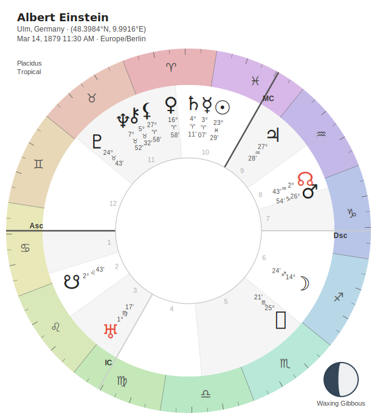

**Description:** Traditional spectrum colors across the zodiac

**Accessibility:** ✅ Good - Adaptive glyphs ensure readability

**Color scheme:**

- Aries → Pisces: Red → Orange → Yellow → Green → Blue → Purple → Red

**Best for:**

- Learning astrology
- General use
- Friendly, approachable presentations
- First charts

**Why use it:** Familiar spectrum makes signs instantly distinguishable

---

#### Elemental (Grouped by Element)

```python
chart.draw().with_zodiac_palette("elemental").save()
```

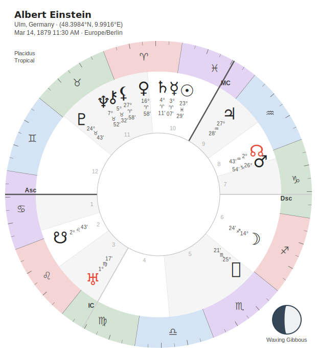

**Description:** Signs colored by their element

**Accessibility:** ✅ Good - Clear element groupings

**Color scheme:**

- Fire signs (Aries, Leo, Sagittarius): Red/Orange
- Earth signs (Taurus, Virgo, Capricorn): Green/Brown
- Air signs (Gemini, Libra, Aquarius): Yellow/Light Blue
- Water signs (Cancer, Scorpio, Pisces): Blue/Purple

**Best for:**

- Teaching elemental dignities
- Traditional astrology
- Educational materials
- Emphasizing elemental balance

**Why use it:** Color-codes astrological structure for instant visual recognition

---

#### Cardinality (Grouped by Modality)

```python
chart.draw().with_zodiac_palette("cardinality").save()
```

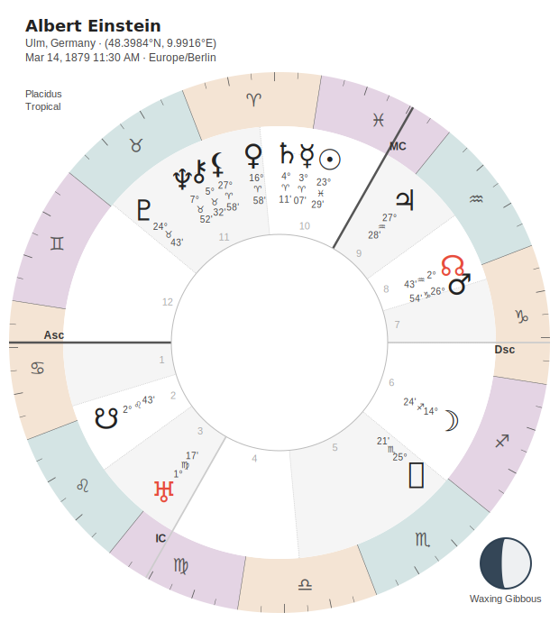

**Description:** Signs colored by their modality (quality)

**Accessibility:** ✅ Good - Clear modality groupings

**Color scheme:**

- Cardinal signs (Aries, Cancer, Libra, Capricorn): Red shades
- Fixed signs (Taurus, Leo, Scorpio, Aquarius): Blue shades
- Mutable signs (Gemini, Virgo, Sagittarius, Pisces): Green shades

**Best for:**

- Teaching modalities
- Pattern recognition (Cardinal/Fixed/Mutable)
- Educational presentations
- Analyzing chart dynamics

**Why use it:** Highlights modality patterns that elemental grouping doesn't show

---

### Theme-Coordinated Palettes

These palettes are designed to harmonize with specific themes.

#### Rainbow Midnight (for Midnight theme)

```python
chart.draw().with_theme("midnight").with_zodiac_palette("rainbow_midnight").save()
```

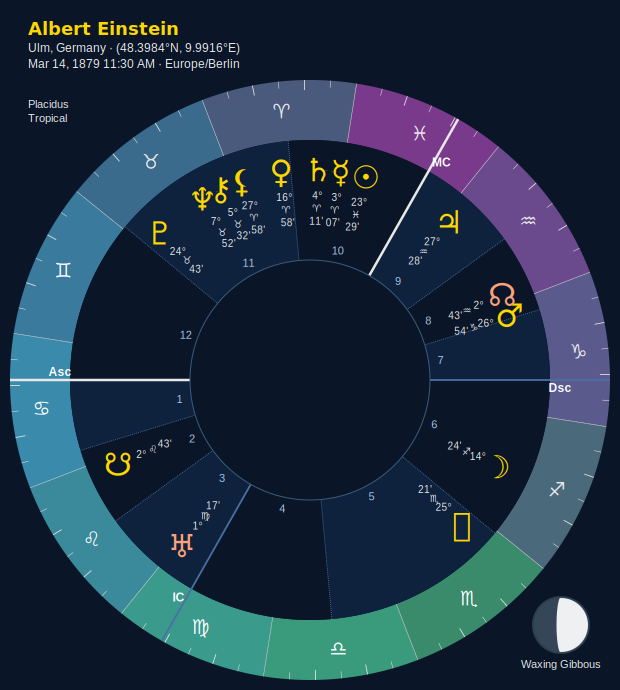

**Description:** Deep, rich colors coordinated with navy background

**Accessibility:** ✅ Excellent - Designed for navy background

**Best for:**

- Midnight theme (THE PERFECT CHART)
- Night sky aesthetic
- Professional presentations
- Elegant, sophisticated charts

**Why use it:** Every color perfectly coordinated with deep navy. Feels like stargazing.

---

#### Rainbow Celestial (for Celestial theme)

```python
chart.draw().with_theme("celestial").with_zodiac_palette("rainbow_celestial").save()
```

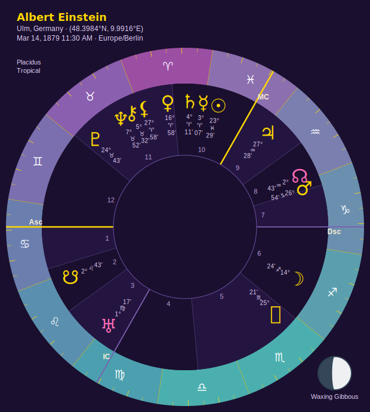

**Description:** Cosmic purples and pinks for galaxy aesthetic

**Accessibility:** ✅ Excellent - Designed for purple background

**Best for:**

- Celestial theme
- Mystical presentations
- Spiritual work
- Cosmic, otherworldly aesthetic

**Why use it:** Harmonizes with deep purple background for cohesive galaxy vibe

---

#### Rainbow Neon (for Neon theme)

```python
chart.draw().with_theme("neon").with_zodiac_palette("rainbow_neon").save()
```

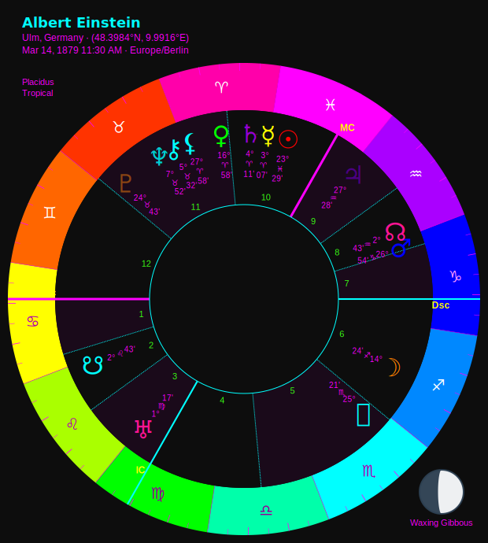

**Description:** Electric, fully saturated colors

**Accessibility:** ✅ Excellent - Maximum contrast on black

**Best for:**

- Neon theme (MAXIMUM IMPACT)
- Cyberpunk aesthetic
- Eye-catching presentations
- Social media, attention-grabbing charts

**Why use it:** Unapologetically BOLD. Pure black background makes colors POP.

---

### Scientific Palettes

Perceptually uniform palettes from scientific visualization. All are colorblind-friendly (except Turbo).

#### Viridis

```python
chart.draw().with_zodiac_palette("viridis").save()
```

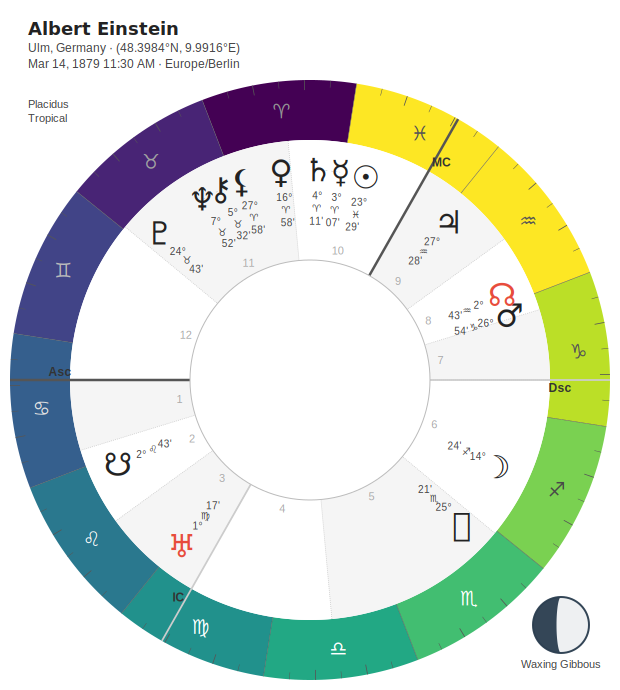

**Description:** Yellow-green-blue gradient

**Accessibility:** ✅✅ Excellent - Colorblind-friendly

**Colorblind support:** Deuteranopia, Protanopia, Tritanopia

**Best for:**

- Data visualization aesthetic
- Accessibility requirements
- Scientific contexts
- Professional presentations

**Why use it:** THE standard for scientific visualization. Perceptually uniform, universally trusted.

---

#### Plasma

```python
chart.draw().with_zodiac_palette("plasma").save()
```


**Description:** Blue-purple-pink-yellow gradient

**Accessibility:** ✅✅ Excellent - Colorblind-friendly

**Colorblind support:** Deuteranopia, Protanopia, Tritanopia

**Best for:**

- Beautiful gradients
- Presentations where aesthetics matter
- Scientific contexts with color
- Modern data viz aesthetic

**Why use it:** More colorful than Viridis while maintaining scientific rigor. Pretty AND accessible.

---

#### Inferno

```python
chart.draw().with_zodiac_palette("inferno").save()
```

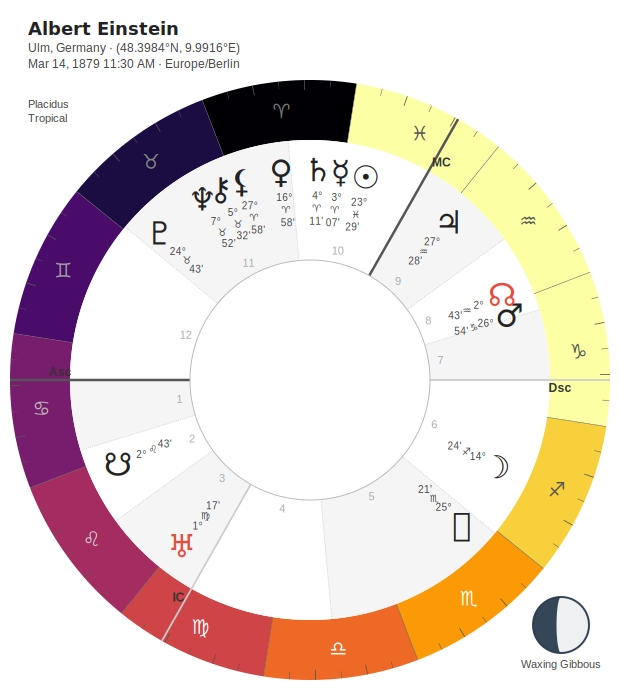

**Description:** Black-purple-orange-yellow gradient

**Accessibility:** ✅✅ Excellent - Colorblind-friendly

**Colorblind support:** Deuteranopia, Protanopia, Tritanopia

**Best for:**

- Warm aesthetic
- Dramatic presentations
- Data visualization
- Emotional impact

**Why use it:** Warm colors create impact while staying scientifically rigorous

---

#### Magma

```python
chart.draw().with_zodiac_palette("magma").save()
```


**Description:** Black-purple-pink-yellow gradient (Inferno's prettier sibling!)

**Accessibility:** ✅✅ Excellent - Colorblind-friendly

**Colorblind support:** Deuteranopia, Protanopia, Tritanopia

**Best for:**

- Mystical presentations
- Beautiful scientific aesthetic
- Artistic displays
- Cosmic/volcanic themes

**Why use it:** Like Inferno but with more purple/pink. Softer, more mystical, still rigorous.

---

#### Cividis

```python
chart.draw().with_zodiac_palette("cividis").save()
```

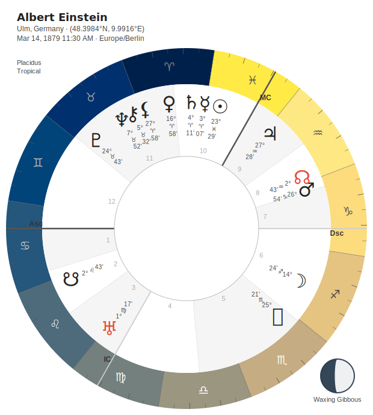

**Description:** Blue-yellow gradient optimized for ALL types of colorblindness

**Accessibility:** ✅✅✅ MAXIMUM - Optimized for universal accessibility

**Colorblind support:** Deuteranopia, Protanopia, Tritanopia, AND normal vision

**Best for:**

- MAXIMUM accessibility
- Inclusive presentations
- Universal design
- When inclusivity is paramount

**Why use it:** The ONLY palette designed specifically for colorblind accessibility. Use when accessibility matters most.

---

#### Turbo

```python
chart.draw().with_zodiac_palette("turbo").save()
```

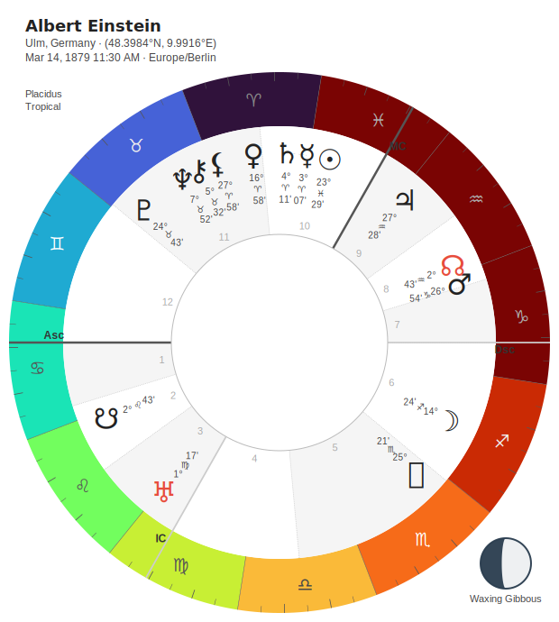

**Description:** Full spectrum rainbow - Google's improved rainbow

**Accessibility:** ⚠️ Fair - NOT colorblind-friendly

**Colorblind support:** None (uses full spectrum)

**Best for:**

- Maximum color range
- Vibrant presentations
- Artistic displays
- When accessibility isn't critical

**Why use it:** Better perceptual uniformity than traditional rainbows. Maximum color, minimum artifacts. Just not colorblind-safe.

---

#### Sepia Rainbow

```python
chart.draw().with_zodiac_palette("rainbow_sepia").save()
```

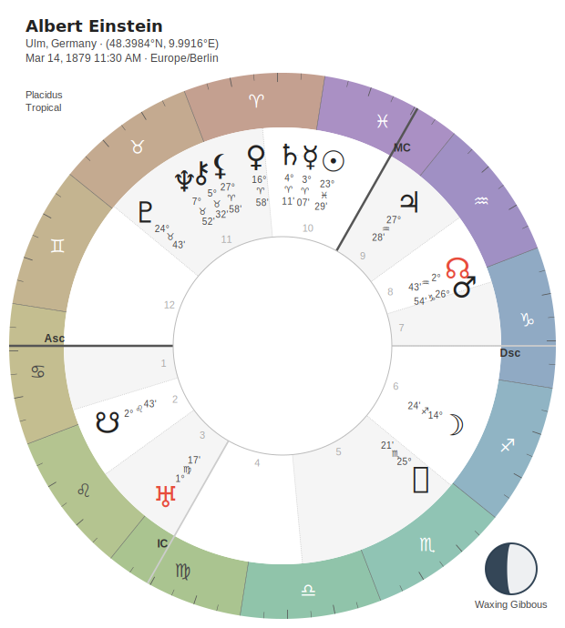

---

#### Spectral

```python
chart.draw().with_zodiac_palette("spectral").save()
```

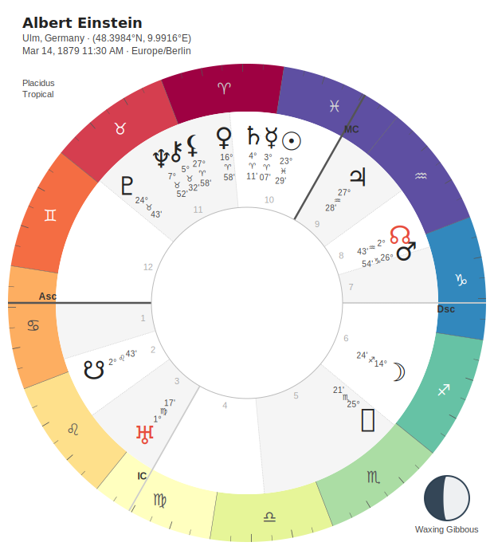

---

#### Elemental Midnight

```python
chart.draw().with_zodiac_palette("elemental_midnight").save()
```

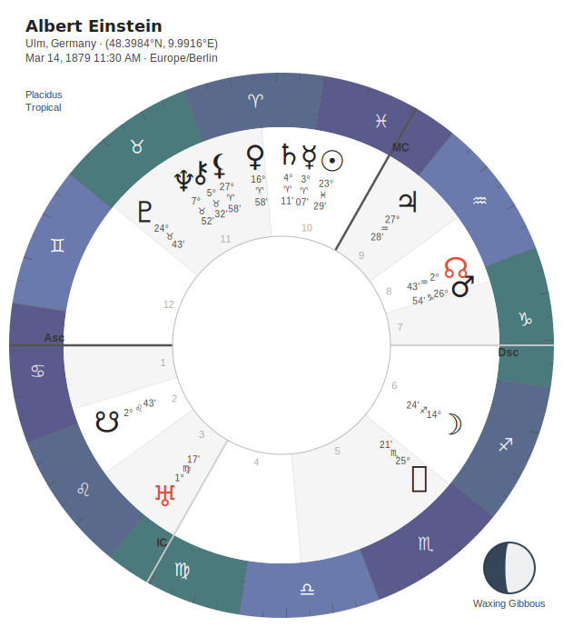

---

#### Elemental Neon

```python
chart.draw().with_zodiac_palette("elemental_neon").save()
```

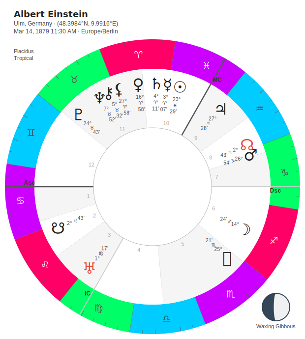

---

## Aspect Line Palettes

Control the colors of aspect lines connecting planets. Most themes use aspect-specific colors (red for squares, blue for trines) which override the palette for major aspects. Palettes mainly affect minor/harmonic aspects.

### Classic

```python
chart.draw().with_aspect_palette("classic").save()
```

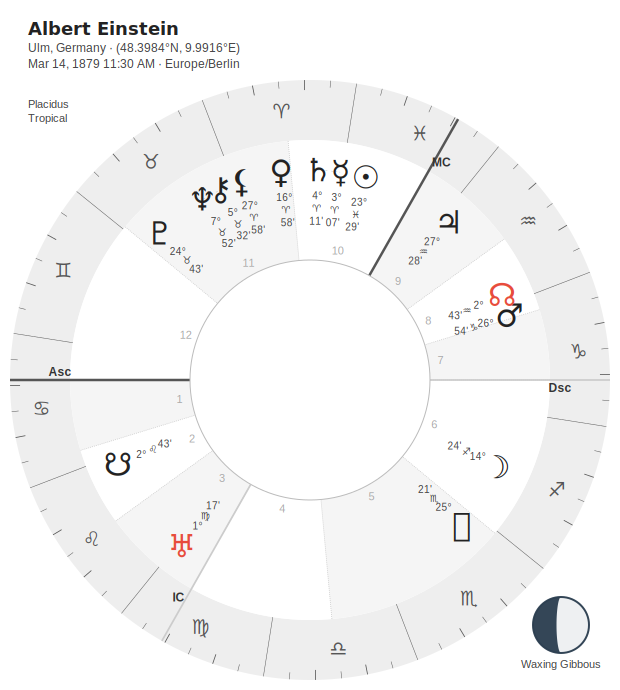

**Description:** Traditional aspect colors (red squares, blue trines, etc.)

**Best for:** Traditional astrology, general use

---

### Dark

```python
chart.draw().with_aspect_palette("dark").save()
```


**Description:** Muted aspect colors for dark backgrounds

**Best for:** Dark theme, midnight theme

---

### Blues

```python
chart.draw().with_aspect_palette("blues").save()
```


**Description:** Blue gradient for all aspects

**Best for:** Cohesive blue aesthetic, calming presentations

---

### Purples

```python
chart.draw().with_aspect_palette("purples").save()
```


**Description:** Purple gradient for all aspects

**Best for:** Mystical aesthetic, spiritual work

---

### Pastel

```python
chart.draw().with_aspect_palette("pastel").save()
```


**Description:** Soft gentle colors

---

### Scientific Aspect Palettes

All scientific palettes (Viridis, Plasma, Inferno, Magma, Cividis, Turbo) are available for aspect lines:

```python
chart.draw().with_aspect_palette("plasma").save()
```


---

## Planet Glyph Palettes

Control the colors of planet symbols.

### Default

```python
chart.draw().with_planet_glyph_palette("default").save()
```

**Description:** Uniform color from theme (typically black or gold)

**Best for:** Clean, consistent aesthetic


---

### Element

```python
chart.draw().with_planet_glyph_palette("element").save()
```

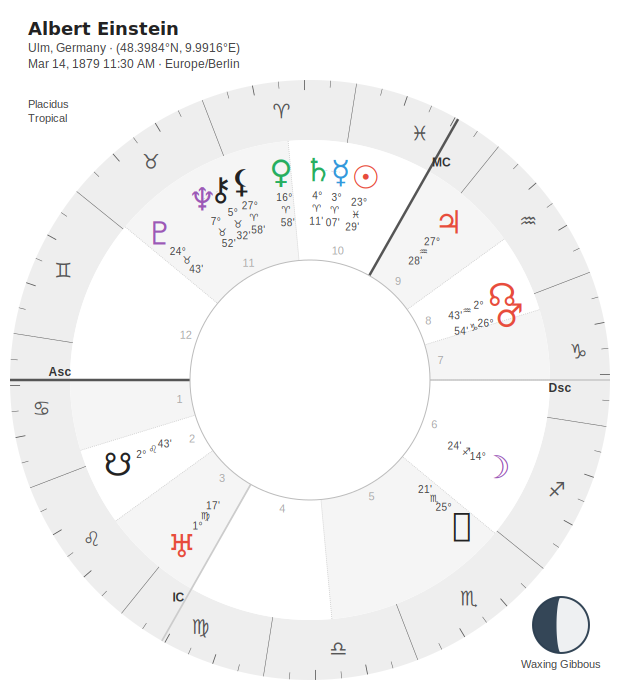

**Description:** Planets colored by their elemental association

**Color scheme:**

- Fire planets (Mars, Sun): Red/Orange
- Earth planets (Saturn, Venus): Green/Brown
- Air planets (Mercury, Uranus): Yellow/Light Blue
- Water planets (Moon, Neptune): Blue/Purple

**Best for:** Teaching planetary elements, elemental emphasis

---

### Sign Ruler

```python
chart.draw().with_planet_glyph_palette("sign_ruler").save()
```

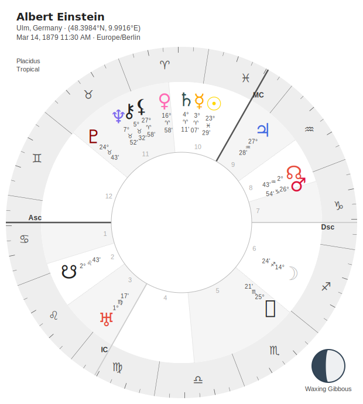

**Description:** Planets colored by their sign rulership

**Best for:** Emphasizing rulerships, traditional astrology

---

### Planet Type

```python
chart.draw().with_planet_glyph_palette("planet_type").save()
```

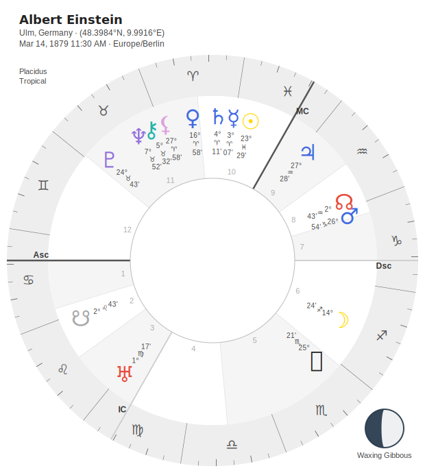

**Description:** Planets grouped by type

**Color scheme:**

- Personal planets (Sun, Moon, Mercury, Venus, Mars): Red
- Social planets (Jupiter, Saturn): Blue
- Transpersonal planets (Uranus, Neptune, Pluto): Purple

**Best for:** Teaching planetary spheres, modern astrology

---

### Luminaries

```python
chart.draw().with_planet_glyph_palette("luminaries").save()
```

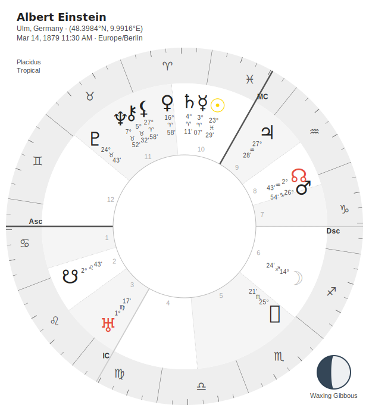

**Description:** Sun and Moon highlighted, others neutral

**Best for:** Emphasizing lights, traditional focus

---

### Rainbow

```python
chart.draw().with_planet_glyph_palette("rainbow").save()
```

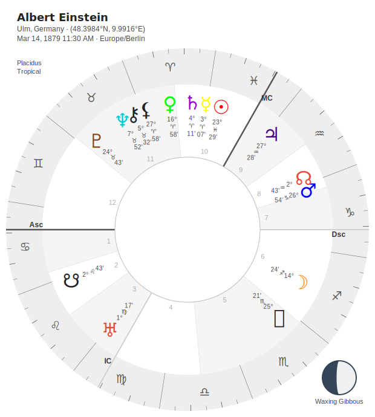

**Description:** Each planet gets a spectrum color

**Best for:** Colorful presentations, learning planets

---

### Chakra

```python
chart.draw().with_planet_glyph_palette("chakra").save()
```

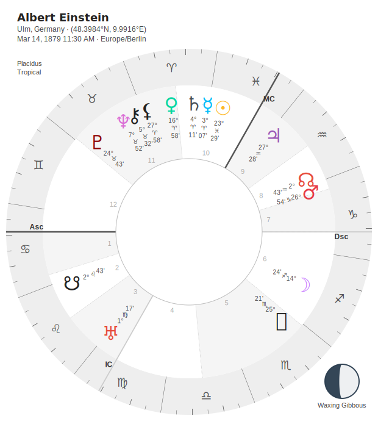

**Description:** Planets colored by chakra associations

**Best for:** Spiritual work, energy-focused astrology

---

### Scientific Planet Palettes

All scientific palettes (Viridis, Plasma, Inferno, Magma, Cividis, Turbo) are available for planet glyphs:

```python
chart.draw().with_planet_glyph_palette("viridis").save()
```

---

## Accessibility Guide

### Colorblind-Friendly Palettes

**Deuteranopia & Protanopia (Red-Green Colorblindness):**

- ✅✅✅ Cividis (BEST)
- ✅✅ Viridis, Plasma, Inferno, Magma
- ✅ Grey (always safe)

**Tritanopia (Blue-Yellow Colorblindness):**

- ✅✅✅ Cividis (BEST)
- ✅✅ Viridis, Plasma, Inferno, Magma
- ✅ Grey (always safe)

**All Types of Colorblindness:**

- ✅✅✅ **Cividis** - The ONLY palette optimized for ALL types
- ✅✅ Scientific palettes (Viridis, Plasma, Inferno, Magma)
- ✅ Grey monochrome

---

### Print-Friendly Palettes

**Black & White Printing:**

- ✅✅✅ Grey (perfect)
- ✅ Viridis (good grayscale conversion)

**Color Printing:**

- ✅ Any palette works
- ✅✅ Rainbow, Elemental, Cardinality (clear on paper)

---

### High Contrast Requirements

**WCAG AA Compliant (4.5:1 minimum):**

- ✅ ALL palettes (zodiac wheel glyphs are ALWAYS adaptively colored)
- ✅ Grey (inherently high contrast)
- ✅ Cividis (designed for accessibility)

**Note:** Stellium automatically adjusts zodiac wheel glyph colors for contrast against their backgrounds, ensuring WCAG AA compliance regardless of palette choice.

---

## Palette Combinations

### Coordinated Sets (Same Palette Everywhere)

For visual harmony, use the same palette across all three systems:

```python
chart.draw() \
    .with_zodiac_palette("viridis") \
    .with_aspect_palette("viridis") \
    .with_planet_glyph_palette("viridis") \
    .save()
```

**Works well with:** All scientific palettes (Viridis, Plasma, Inferno, Magma, Turbo)

---

### Mixed Palettes (Intentional Contrast)

Combine different palettes for specific emphasis:

```python
# Emphasize elements, neutral aspects
chart.draw() \
    .with_zodiac_palette("elemental") \
    .with_aspect_palette("blues") \
    .with_planet_glyph_palette("element") \
    .save()

# Monochrome structure, colorful planets
chart.draw() \
    .with_zodiac_palette("grey") \
    .with_aspect_palette("classic") \
    .with_planet_glyph_palette("rainbow") \
    .save()
```

---

### Theme-First Approach (Recommended)

Let the theme choose default palettes, then override only what you need:

```python
# Theme sets defaults (midnight uses rainbow_midnight)
chart.draw().with_theme("midnight").save()

# Theme sets defaults, override zodiac only
chart.draw() \
    .with_theme("midnight") \
    .with_zodiac_palette("grey") \
    .save()
```

---

## Quick Reference

### By Accessibility Need

**Maximum Accessibility:**

- Cividis (all colorblindness types)
- Grey (monochrome)

**Good Accessibility:**

- Viridis, Plasma, Inferno, Magma (colorblind-friendly)
- Elemental, Cardinality (clear structure)

**Not Colorblind-Friendly:**

- Turbo (full spectrum)
- Rainbow (traditional spectrum)

---

### By Use Case

**For Printing:**

- Grey (best)
- Viridis (good grayscale)

**For Education:**

- Elemental (teaches elements)
- Cardinality (teaches modalities)
- Planet Type (teaches planetary spheres)

**For Aesthetics:**

- Rainbow Midnight (with Midnight theme)
- Rainbow Celestial (with Celestial theme)
- Rainbow Neon (with Neon theme)
- Plasma, Magma (scientific beauty)

**For Data Visualization:**

- Viridis (standard)
- Plasma (beautiful)
- Cividis (accessible)

**For Tradition:**

- Grey (classical)
- Classic aspects (traditional colors)

---

## Generating Your Own Examples

All examples in this gallery were generated using the same natal chart (Albert Einstein) for consistency:

```python
from stellium import ChartBuilder

chart = ChartBuilder.from_notable("Albert Einstein").with_angles().calculate()

# Generate any palette
chart.draw("my_palette.svg") \
    .with_zodiac_palette("viridis") \
    .save()
```

---

## See Also

- [Visualization Guide](VISUALIZATION.md) - Complete API documentation
- [Theme Gallery](THEME_GALLERY.md) - Visual showcase of all themes
- [Main README](../README.md) - Project overview

---

**Choose your palette. Paint the cosmos.** ✨
