# Stellium Theme Gallery

**Visual showcase of all available themes with recommended palette combinations.**

This gallery demonstrates each of Stellium's 13 themes with carefully chosen palette pairings. Each theme creates a distinct mood and aesthetic - find the one that matches your vision!

## Table of Contents

- [Classic Themes](#classic-themes)
  - [Classic](#classic)
  - [Dark](#dark)
- [Specialty Themes](#specialty-themes)
  - [Midnight](#midnight-the-perfect-chart)
  - [Celestial](#celestial-cosmic-consciousness)
  - [Neon](#neon-the-bold-one)
  - [Sepia](#sepia-vintage-elegance)
  - [Pastel](#pastel-gentle-softness)
- [Scientific Themes](#scientific-themes)
  - [Viridis](#viridis)
  - [Plasma](#plasma)
  - [Inferno](#inferno)
  - [Magma](#magma-infernos-prettier-sibling)
  - [Cividis](#cividis-maximum-accessibility)
  - [Turbo](#turbo)
- [Quick Reference](#quick-reference)

---

## Classic Themes

### Classic

**Clean white background, professional and traditional**

The default theme. Perfect for general use, printing, tutorials, and anywhere you need a clean, accessible chart.

#### Classic + Grey (Printer-Friendly Monochrome)

```python
chart.draw("classic_grey.svg") \
    .with_theme("classic") \
    .with_zodiac_palette("grey") \
    .save()
```

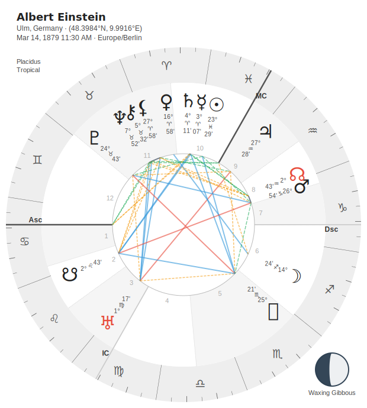

**Best for:** Printing, photocopying, black-and-white publications, professional minimalism

**Why it works:** High contrast, no color distractions, reads clearly even on lower-quality printers

---

#### Classic + Rainbow (Friendly First Chart)

```python
chart.draw("classic_rainbow.svg") \
    .with_theme("classic") \
    .with_zodiac_palette("rainbow") \
    .save()
```

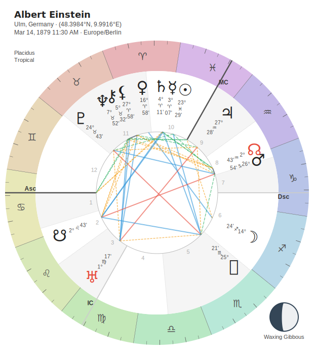

**Best for:** Learning astrology, first charts, approachable presentations

**Why it works:** Classic spectrum colors are familiar and non-threatening. Good for beginners.

---

#### Classic + Elemental (Educational Focus)

```python
chart.draw("classic_elemental.svg") \
    .with_theme("classic") \
    .with_zodiac_palette("elemental") \
    .save()
```

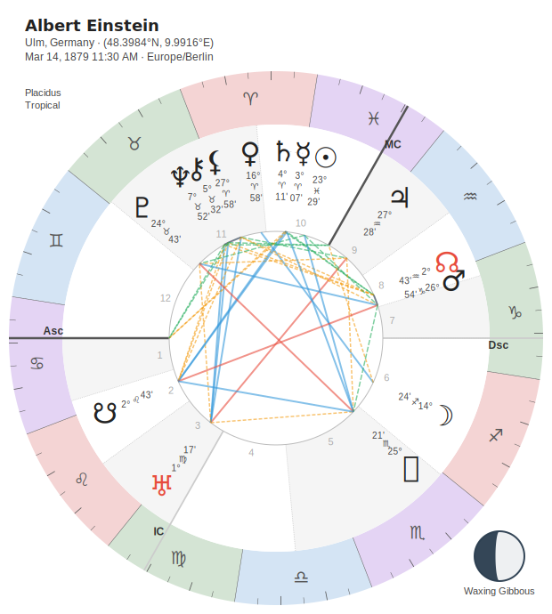

**Best for:** Teaching elemental dignities, traditional astrology, educational materials

**Why it works:** Color-codes signs by element (Fire/Earth/Air/Water) for instant visual recognition

---

### Dark

**Dark gray background, modern and reduced eye strain**

Perfect for dark mode enthusiasts, screen viewing, and accessibility.

#### Dark + Grey (Clean Dark Mode Monochrome)

```python
chart.draw("dark_grey.svg") \
    .with_theme("dark") \
    .with_zodiac_palette("grey") \
    .save()
```

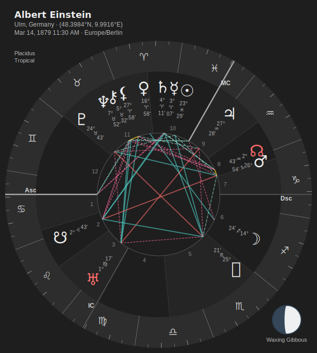

**Best for:** Dark mode apps, reduced eye strain, modern minimalism

**Why it works:** All the benefits of monochrome with the comfort of a dark background

---

#### Dark + Rainbow (Vibrant on Dark)

```python
chart.draw("dark_rainbow.svg") \
    .with_theme("dark") \
    .with_zodiac_palette("rainbow") \
    .save()
```

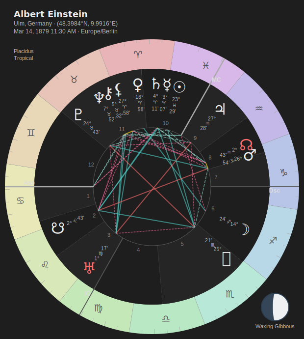

**Best for:** Screen viewing, presentations on dark backgrounds

**Why it works:** Colors pop against dark gray without being overwhelming

---

#### Dark + Viridis (Scientific Dark Mode)

```python
chart.draw("dark_viridis.svg") \
    .with_theme("dark") \
    .with_zodiac_palette("viridis") \
    .save()
```

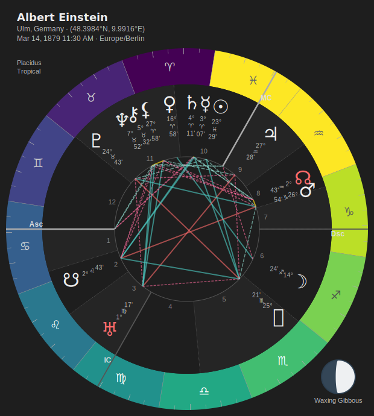

**Best for:** Data visualization aesthetic, colorblind-friendly dark mode

**Why it works:** Perceptually uniform scientific palette on professional dark background

---

## Specialty Themes

### Midnight: "The Perfect Chart"

**Deep navy background (#0A1628) with gold accents - night sky elegance**

Midnight is sophisticated without being pretentious. It feels like actual stargazing.

#### Midnight + Rainbow Midnight ⭐ **FEATURED COMBINATION**

```python
chart.draw("midnight_rainbow_midnight.svg") \
    .with_theme("midnight") \
    .with_zodiac_palette("rainbow_midnight") \
    .save()
```

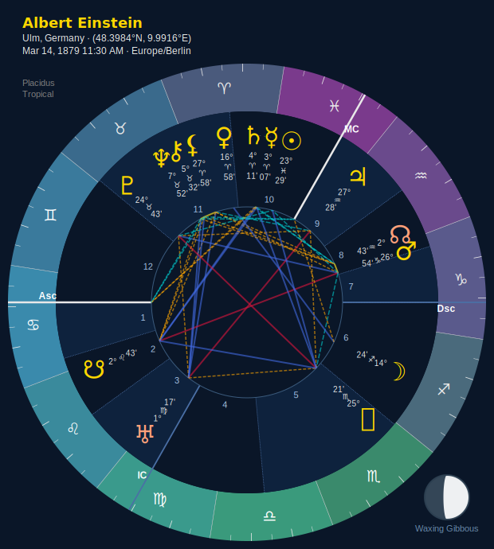

**This is THE PERFECT CHART.** Deep navy background with perfectly coordinated zodiac colors and gold planet glyphs. Elegant, beautiful, professional.

**Best for:** Professional readings, beautiful presentations, clients who appreciate aesthetics

**Why it's perfect:** Every color is coordinated. The navy background evokes an actual night sky. Gold planets feel celestial without being cheesy. This is the chart you show when you want people to take astrology seriously.

---

#### Midnight + Grey (Subtle Elegance)

```python
chart.draw("midnight_grey.svg") \
    .with_theme("midnight") \
    .with_zodiac_palette("grey") \
    .save()
```

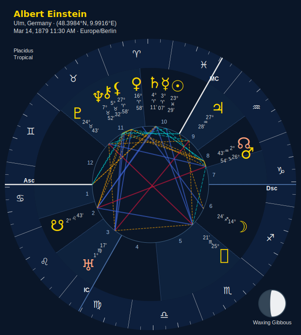

**Best for:** Ultra-minimal presentations, sophisticated dark mode

**Why it works:** Monochrome on navy creates a subtle, refined aesthetic

---

### Celestial: "Cosmic Consciousness"

**Deep purple background (#1A0F2E) - galaxy aesthetic**

Mystical and cosmic without being tacky. For when you want that spiritual vibe done RIGHT.

#### Celestial + Rainbow Celestial ⭐ **FEATURED COMBINATION**

```python
chart.draw("celestial_rainbow_celestial.svg") \
    .with_theme("celestial") \
    .with_zodiac_palette("rainbow_celestial") \
    .save()
```

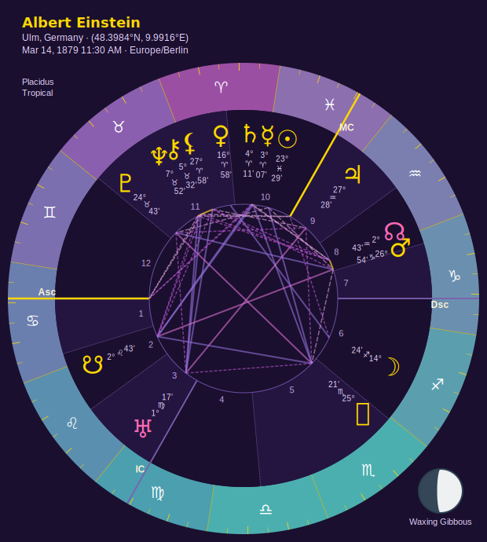

**Cosmic Consciousness.** Deep purple galaxy background with perfectly matched purples and cosmic pink/purple planet glyphs. Mystical but not cheesy.

**Best for:** Spiritual work, mystical presentations, cosmic exploration

**Why it works:** The deep purple feels otherworldly. Rainbow Celestial palette coordinates perfectly. This is mysticism with taste.

---

#### Celestial + Magma (Purple-to-Pink Volcanic)

```python
chart.draw("celestial_magma.svg") \
    .with_theme("celestial") \
    .with_zodiac_palette("magma") \
    .save()
```

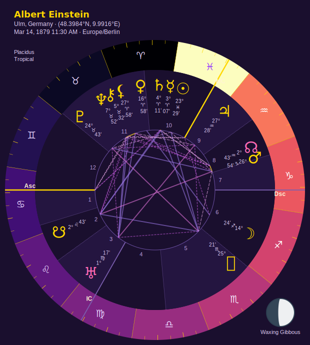

**Best for:** Dramatic presentations, artistic displays

**Why it works:** Magma's purple-pink gradient harmonizes with the purple background for a cohesive volcanic-cosmic aesthetic

---

### Neon: "The Bold One"

**Pure black background (#000000) - cyberpunk high contrast**

Unapologetically LOUD. Electric. Fun. For when you want your chart to POP.

#### Neon + Rainbow Neon ⭐ **FEATURED COMBINATION**

```python
chart.draw("neon_rainbow_neon.svg") \
    .with_theme("neon") \
    .with_zodiac_palette("rainbow_neon") \
    .save()
```


**MAXIMUM IMPACT.** Electric saturated colors on pure black. This chart SCREAMS. Perfect for when you want attention.

**Best for:** Eye-catching presentations, modern aesthetic, cyberpunk vibes, social media

**Why it works:** Pure black background makes every color POP. Rainbow Neon uses fully saturated colors. This isn't subtle - it's BOLD and FUN.

---

#### Neon + Turbo (Full Spectrum Rainbow)

```python
chart.draw("neon_turbo.svg") \
    .with_theme("neon") \
    .with_zodiac_palette("turbo") \
    .save()
```

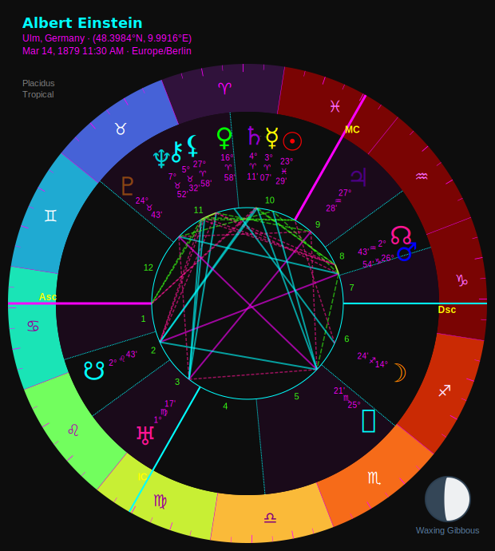

**Best for:** Maximum color range, artistic experimentation

**Why it works:** Turbo's improved rainbow palette on black creates vibrant, full-spectrum impact

---

### Sepia: "Vintage Elegance"

**Aged paper background (#F4ECD8) - antique book aesthetic**

For historical charts, vintage presentations, or when you want that "ancient manuscript" feel.

#### Sepia + Grey (Classic Vintage Book)

```python
chart.draw("sepia_grey.svg") \
    .with_theme("sepia") \
    .with_zodiac_palette("grey") \
    .save()
```

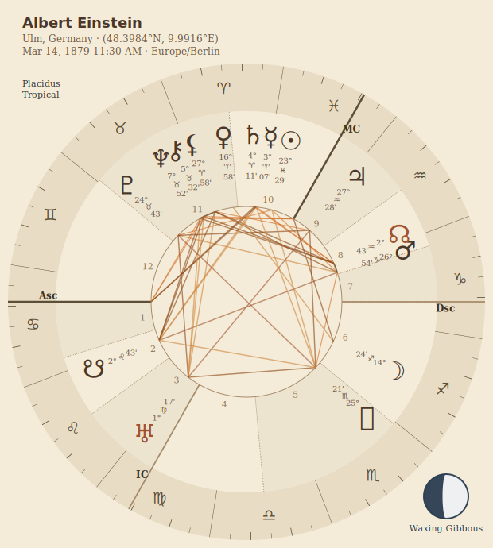

**Best for:** Historical charts, vintage aesthetic, antique reproductions

**Why it works:** Monochrome on aged paper feels like an old astrology text

---

#### Sepia + Elemental (Warm Traditional)

```python
chart.draw("sepia_elemental.svg") \
    .with_theme("sepia") \
    .with_zodiac_palette("elemental") \
    .save()
```


**Best for:** Traditional astrology, warm aesthetic, teaching historical methods

**Why it works:** Elemental colors on aged paper evoke classical astrology texts

---

### Pastel: "Gentle Softness"

**Soft cream background (#FFF8F0) - calming and muted**

For soft presentations, gentle aesthetics, or when you need a calming visual.

#### Pastel + Grey (Gentle Monochrome)

```python
chart.draw("pastel_grey.svg") \
    .with_theme("pastel") \
    .with_zodiac_palette("grey") \
    .save()
```

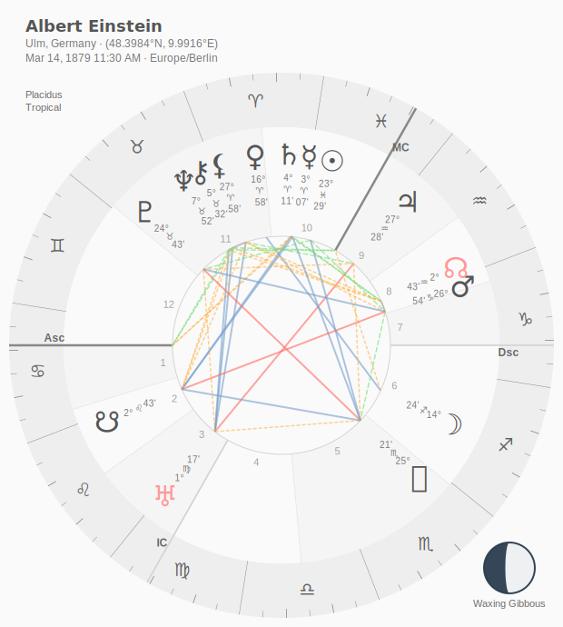

**Best for:** Calming presentations, soft aesthetic, printed materials

**Why it works:** Soft cream with neutral gray creates a gentle, non-threatening vibe

---

#### Pastel + Rainbow (Soft Spectrum)

```python
chart.draw("pastel_rainbow.svg") \
    .with_theme("pastel") \
    .with_zodiac_palette("rainbow") \
    .save()
```

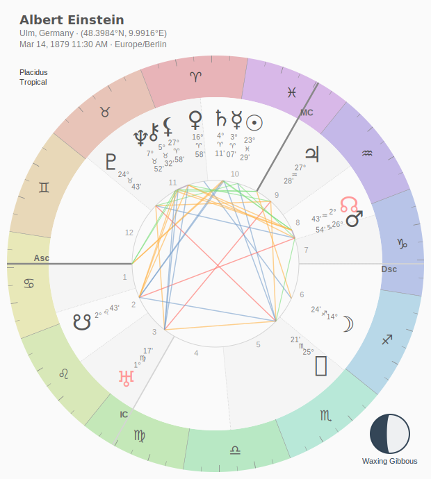

**Best for:** Gentle color, muted presentations, soft educational materials

**Why it works:** Rainbow colors on cream are colorful without being overwhelming

---

## Scientific Themes

These themes use perceptually uniform color scales from scientific visualization. All are colorblind-friendly (except Turbo).

### Viridis

**Yellow-green-blue gradient - THE standard for scientific visualization**

```python
chart.draw("viridis.svg") \
    .with_theme("viridis") \
    .save()
```

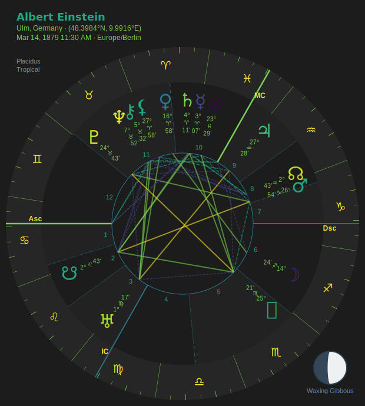

**Best for:** Data visualization, accessibility, professional scientific aesthetic

**Accessibility:** Colorblind-friendly (deuteranopia, protanopia, tritanopia)

**Why it's great:** Perceptually uniform (equal perceived brightness changes), industry standard, universally trusted

---

### Plasma

**Blue-purple-pink-yellow gradient - beautiful and scientific**

```python
chart.draw("plasma.svg") \
    .with_theme("plasma") \
    .save()
```

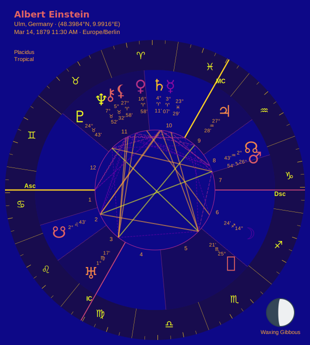

**Best for:** Beautiful gradients, presentations where aesthetics matter, scientific contexts

**Accessibility:** Colorblind-friendly

**Why it's great:** More colorful than Viridis while maintaining perceptual uniformity. Pretty AND scientific.

---

### Inferno

**Black-purple-orange-yellow gradient - warm and dramatic**

```python
chart.draw("inferno.svg") \
    .with_theme("inferno") \
    .save()
```

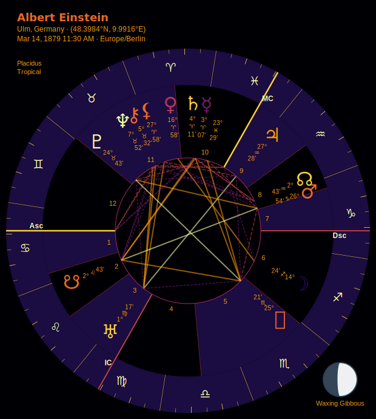

**Best for:** Warm aesthetic, dramatic presentations, data visualization

**Accessibility:** Colorblind-friendly

**Why it's great:** Warm colors create emotional impact while staying scientifically rigorous

---

### Magma: "Inferno's Prettier Sibling"

**Black-purple-pink-yellow gradient - mystical and beautiful**

```python
chart.draw("magma.svg") \
    .with_theme("magma") \
    .save()
```

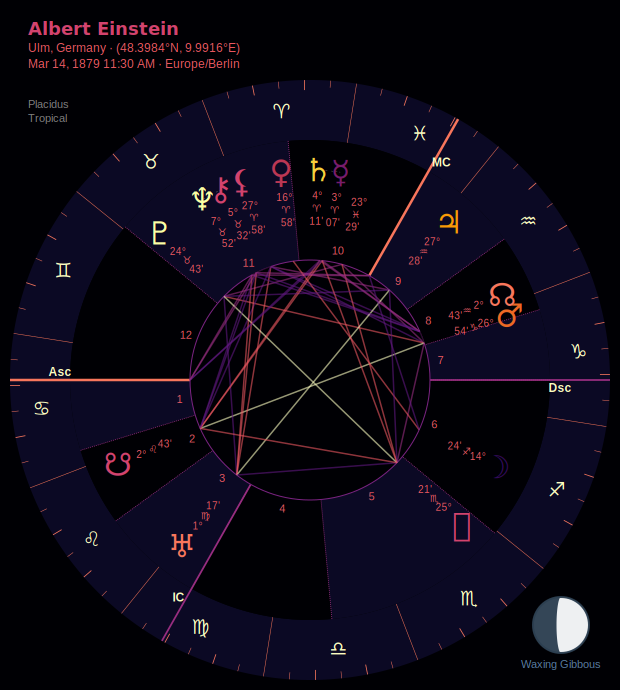

**Best for:** Mystical presentations, beautiful gradients, artistic scientific aesthetic

**Accessibility:** Colorblind-friendly

**Why it's great:** Like Inferno, but with more purple/pink for a softer, more mystical feel. Still scientifically rigorous.

---

### Cividis: "Maximum Accessibility"

**Blue-yellow gradient - optimized for ALL types of colorblindness**

```python
chart.draw("cividis.svg") \
    .with_theme("cividis") \
    .save()
```

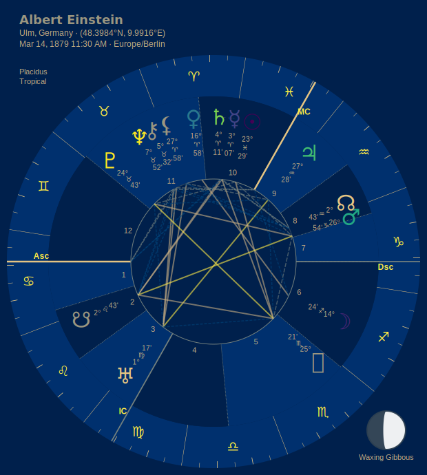

**Best for:** MAXIMUM accessibility, inclusive presentations, universal design

**Accessibility:** Optimized for deuteranopia, protanopia, tritanopia, AND normal vision

**Why it's great:** The ONLY palette designed specifically for colorblind accessibility. Use this when inclusivity matters most.

---

### Turbo

**Full spectrum rainbow - Google's improved rainbow palette**

```python
chart.draw("turbo.svg") \
    .with_theme("turbo") \
    .save()
```

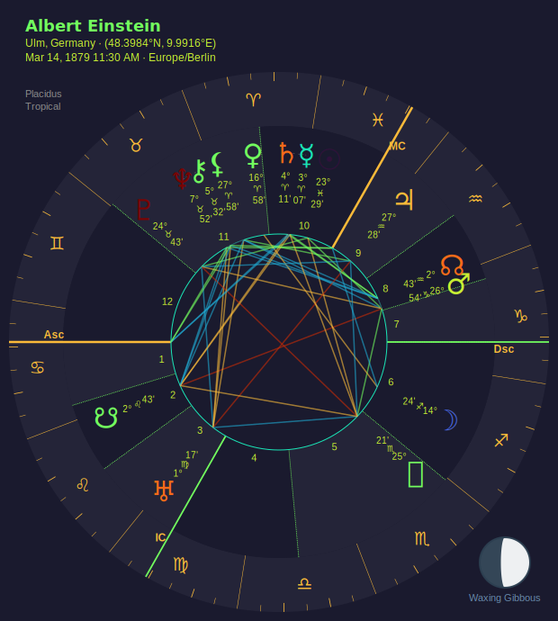

**Best for:** Maximum color range, vibrant presentations, artistic displays

**Accessibility:** NOT colorblind-friendly (uses full spectrum)

**Why it's great:** Google's improved rainbow with better perceptual uniformity than traditional rainbows. Maximum color, minimum artifacts.

---

## Quick Reference

### By Use Case

**For Printing:**
- Classic + Grey
- Sepia + Grey

**For Screen Viewing:**
- Dark + Rainbow
- Midnight + Rainbow Midnight
- Neon + Rainbow Neon

**For Accessibility:**
- Cividis (maximum)
- Viridis
- Dark + Viridis
- Any theme + Grey

**For Beauty:**
- Midnight + Rainbow Midnight ⭐
- Celestial + Rainbow Celestial ⭐
- Plasma
- Magma

**For Impact:**
- Neon + Rainbow Neon ⭐
- Turbo

**For Education:**
- Classic + Elemental
- Classic + Cardinality

**For Professionalism:**
- Midnight + Rainbow Midnight ⭐
- Classic + Grey
- Dark + Grey

### By Mood

**Elegant & Sophisticated:**
- Midnight + Rainbow Midnight
- Midnight + Grey

**Mystical & Spiritual:**
- Celestial + Rainbow Celestial
- Celestial + Magma
- Magma

**Bold & Modern:**
- Neon + Rainbow Neon
- Neon + Turbo
- Turbo

**Warm & Traditional:**
- Sepia + Grey
- Sepia + Elemental
- Inferno

**Calm & Gentle:**
- Pastel + Grey
- Pastel + Rainbow

**Scientific & Professional:**
- Viridis
- Plasma
- Cividis
- Dark + Viridis

---

## Generating Your Own Examples

All examples in this gallery were generated using the same natal chart (Albert Einstein) for consistency:

```python
from stellium import ChartBuilder

chart = ChartBuilder.from_notable("Albert Einstein").with_angles().calculate()

# Generate any combination
chart.draw("my_chart.svg") \
    .with_theme("midnight") \
    .with_zodiac_palette("rainbow_midnight") \
    .save()
```

Try mixing and matching themes and palettes to find your perfect combination!

---

## See Also

- [Visualization Guide](VISUALIZATION.md) - Complete API documentation
- [Palette Gallery](PALETTE_GALLERY.md) - Detailed palette showcase
- [Main README](../README.md) - Project overview

---

**Find your aesthetic. Make beautiful charts.** ✨
