# Stellium Visualization Guide

**Beautiful astrological charts with zero configuration, infinite customization.**

Stellium's visualization system transforms your calculated charts into professional-quality SVG graphics. Whether you need a quick chart for analysis or a publication-ready visualization with custom styling, the fluent API makes it effortless.

See the HTML full theme and palette reference overview [rendered here](https://html-preview.github.io/?url=https://github.com/katelouie/stellium/blob/main/examples/chart_examples/stellium_colors.html).

- [Theme Gallery](THEME_GALLERY.md) - Visual showcase of all themes
- [Palette Gallery](PALETTE_GALLERY.md) - Visual showcase of all palettes

## Table of Contents

- [Quick Start](#quick-start)
- [The Fluent API](#the-fluent-api)
- [Presets](#presets)
- [Themes](#themes)
- [Color Palettes](#color-palettes)
- [Corner Elements](#corner-elements)
- [Moon Phase Display](#moon-phase-display)
- [Advanced Customization](#advanced-customization)
- [Comparison Charts](#comparison-charts)
- [Technical Details](#technical-details)

---

## Quick Start

### Your First Chart (2 Lines)

```python
from stellium import ChartBuilder

chart = ChartBuilder.from_notable("Albert Einstein").with_angles().calculate()
chart.draw("einstein.svg").save()
```

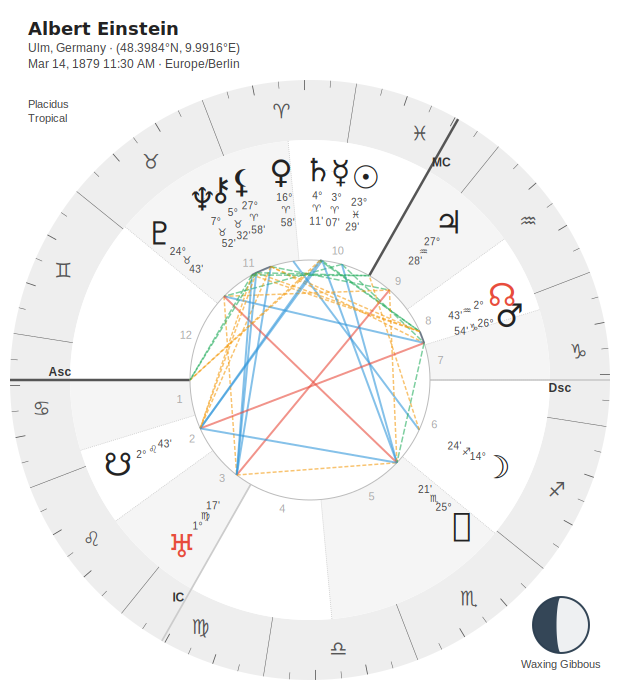

That's it! You now have a beautiful natal chart saved as `einstein.svg`.

### Using Presets

Presets give you instant professional layouts:

```python
# Minimal - just the core chart
chart.draw("minimal.svg").preset_minimal().save()

# Standard - chart with moon phase in center
chart.draw("standard.svg").preset_standard().save()

# Detailed - full chart with info boxes in all corners
chart.draw("detailed.svg").preset_detailed().save()
```

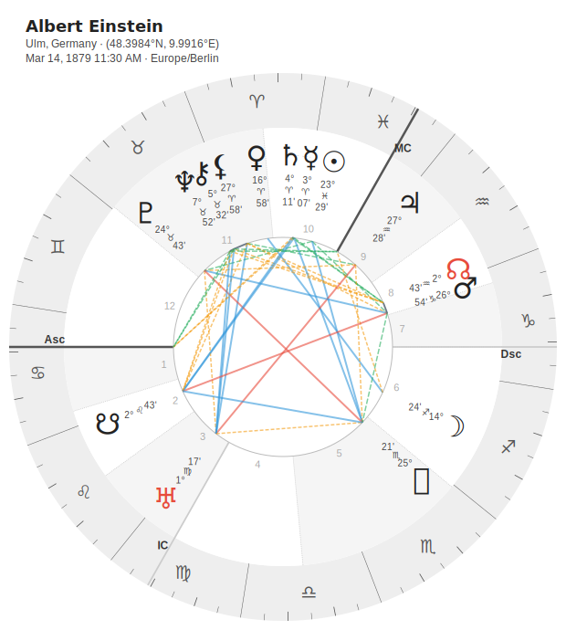
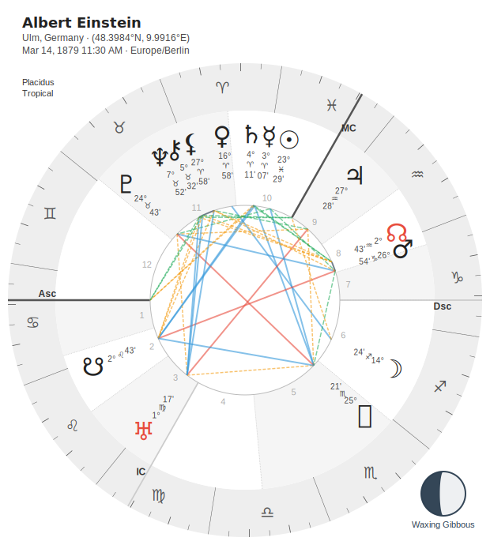
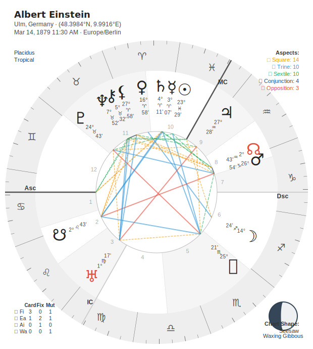

### Adding a Theme

Themes control the overall visual style:

```python
# Elegant night sky
chart.draw("midnight.svg").with_theme("midnight").save()

# Cosmic purple galaxy
chart.draw("celestial.svg").with_theme("celestial").save()

# Bold cyberpunk
chart.draw("neon.svg").with_theme("neon").save()
```

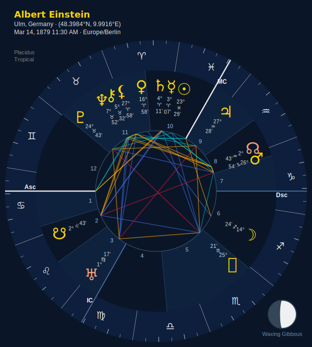
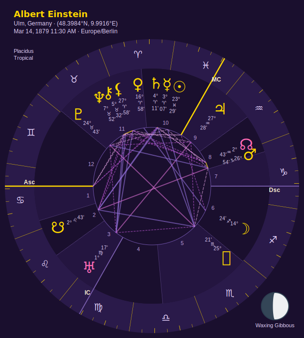
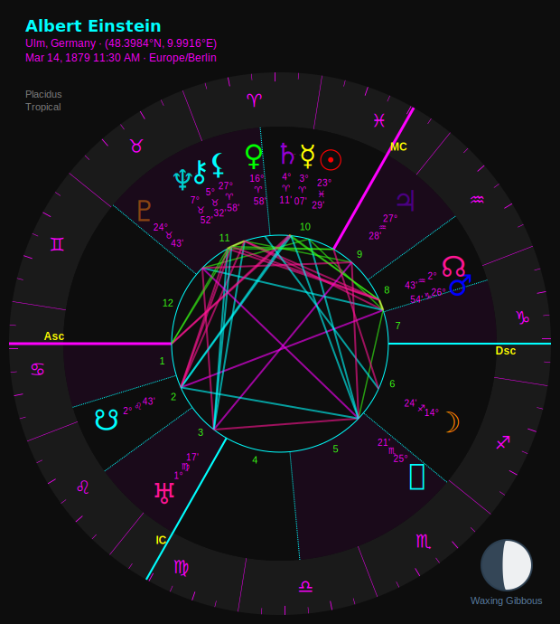

### Custom Configuration

The fluent API makes customization discoverable through autocomplete:

```python
(
chart.draw("custom.svg")
    .with_theme("celestial")
    .with_zodiac_palette("rainbow_celestial")
    .with_moon_phase(position="bottom-left", show_label=True)
    .with_chart_info(position="top-left")
    .with_aspect_counts(position="top-right")
    .save()
)
```

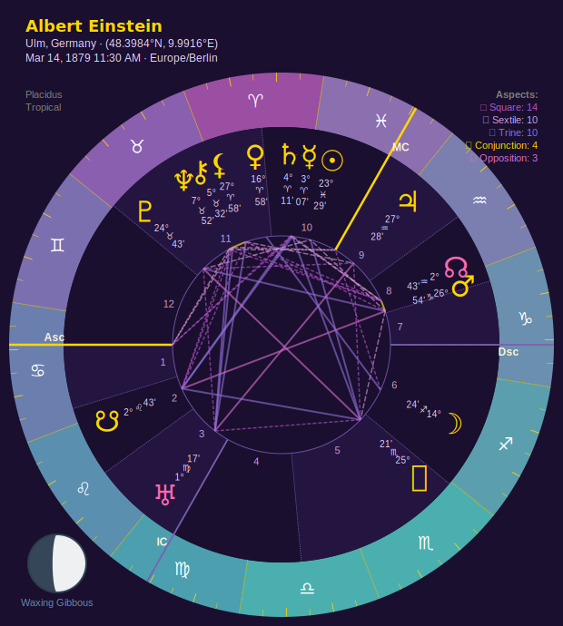

**Tip:** Type `chart.draw("chart.svg").` in your IDE and let autocomplete show you all available options!

---

## The Fluent API

The visualization API is built around method chaining for maximum discoverability and readability.

### Basic Methods

#### `with_filename(filename: str)`

Set the output filename (can also be set in `.draw()` call):

```python
chart.draw().with_filename("my_chart.svg").save()
# Same as:
chart.draw("my_chart.svg").save()
```

#### `with_size(size: int)`

Set the chart size in pixels (default: 600):

```python
chart.draw("large.svg").with_size(800).save()
chart.draw("small.svg").with_size(400).save()
```

**Note:** Size is for the square chart canvas. Extended canvas modes add extra space.

### Theme and Palette Methods

#### `with_theme(theme: str)`

Set the overall visual theme:

```python
chart.draw().with_theme("midnight").save()
```

Available themes:

- `classic` - Clean white background (default)
- `dark` - Dark gray background
- `midnight` - Deep navy, elegant night sky
- `celestial` - Deep purple galaxy
- `neon` - Black background with electric colors
- `sepia` - Aged paper vintage
- `pastel` - Soft muted colors
- Plus scientific palettes: `viridis`, `plasma`, `inferno`, `magma`, `cividis`, `turbo`

See [Themes](#themes) for detailed descriptions and recommended combinations.

#### `with_zodiac_palette(palette: str)`

Set the zodiac wheel color palette:

```python
chart.draw().with_zodiac_palette("rainbow").save()
```

Available palettes:

- `grey` - Monochrome (printer-friendly)
- `rainbow` - Classic spectrum
- `elemental` - Grouped by element (Fire/Earth/Air/Water)
- `cardinality` - Grouped by modality (Cardinal/Fixed/Mutable)
- Plus theme-specific variants and scientific palettes

See [Color Palettes](#color-palettes) for the complete list.

#### `with_aspect_palette(palette: str)`

Set the aspect line color palette:

```python
chart.draw().with_aspect_palette("plasma").save()
```

Common options: `classic`, `dark`, `blues`, `plasma`, `viridis`

#### `with_planet_glyph_palette(palette: str)`

Set the planet glyph color palette:

```python
chart.draw().with_planet_glyph_palette("element").save()
```

Options:

- `default` - Uniform color from theme
- `element` - Colored by planetary element
- `sign_ruler` - Colored by sign rulership
- `planet_type` - Colored by planet type (personal/social/transpersonal)
- `luminaries` - Sun and Moon highlighted
- `rainbow` - Full spectrum
- `chakra` - Chakra color associations
- Plus scientific palettes: `viridis`, `plasma`, etc.

#### `with_adaptive_colors(sign_info: bool = True)`

Enable adaptive coloring for sign glyphs in planet info stacks:

```python
chart.draw().with_adaptive_colors(sign_info=True).save()
```

**Note:** The large zodiac wheel glyphs are ALWAYS adaptively colored for accessibility (WCAG AA compliant). This setting only controls the tiny sign glyphs next to planet positions.

### Corner Element Methods

You can add informational boxes in any corner of the chart:

#### `with_chart_info(position: str = "top-left", fields: list[str] | None = None)`

Add chart metadata:

```python
chart.draw().with_chart_info(position="top-left").save()

# Customize which fields to show
chart.draw().with_chart_info(
    position="top-right",
    fields=["name", "location", "datetime"]
).save()
```

Available fields: `name`, `location`, `datetime`, `timezone`, `coordinates`, `house_system`

#### `with_aspect_counts(position: str = "top-right")`

Add aspect counts summary:

```python
chart.draw().with_aspect_counts(position="top-right").save()
```

Shows a breakdown of aspect types (e.g., "5 Trines, 3 Squares, 2 Oppositions").

#### `with_element_modality_table(position: str = "bottom-left")`

Add element × modality cross-table:

```python
chart.draw().with_element_modality_table(position="bottom-left").save()
```

Shows planetary distribution across Fire/Earth/Air/Water and Cardinal/Fixed/Mutable.

#### `with_chart_shape(position: str = "bottom-right")`

Add chart shape detection:

```python
chart.draw().with_chart_shape(position="bottom-right").save()
```

Identifies patterns like "Bucket", "Bowl", "Locomotive", etc.

**Corner positions:** `top-left`, `top-right`, `bottom-left`, `bottom-right`

### Moon Phase Methods

#### `with_moon_phase(position: str = "center", show_label: bool = False, size: int | None = None, label_size: str | None = None)`

Configure moon phase display:

```python
# Moon in center (default)
chart.draw().with_moon_phase(position="center").save()

# Moon in corner with label
chart.draw().with_moon_phase(position="top-left", show_label=True).save()

# Custom size
chart.draw().with_moon_phase(position="center", size=80).save()
```

**Positions:** `center`, `top-left`, `top-right`, `bottom-left`, `bottom-right`

**Auto-sizing:**

- Center position: 60px radius (default)
- Corner positions: 32px radius (default)

#### `without_moon_phase()`

Disable moon phase display:

```python
chart.draw().without_moon_phase().save()
```

---

## Presets

Presets provide instant professional layouts. You can still customize after applying a preset!

### `preset_minimal()`

Just the core chart - no decorations:

```python
chart.draw().preset_minimal().save()
```

**Includes:**

- Zodiac wheel
- House cusps
- Planet positions
- Aspects

**Excludes:** Moon phase, corner elements

**Best for:** Quick analysis, clean exports, academic use

### `preset_standard()`

Core chart with moon phase in center:

```python
chart.draw().preset_standard().save()
```

**Includes:**

- Everything in minimal
- Moon phase (center position)

**Best for:** General use, personal charts, default output

### `preset_detailed()`

Full chart with info boxes in all corners:

```python
chart.draw().preset_detailed().save()
```

**Includes:**

- Everything in standard
- Chart info (top-left)
- Aspect counts (top-right)
- Element/modality table (bottom-left)
- Chart shape (bottom-right)

**Best for:** Professional readings, comprehensive analysis, teaching

**Note:** Automatically adds padding when >2 corners are occupied for better readability.

### `preset_synastry()`

Optimized for relationship comparison charts:

```python
comparison.draw().preset_synastry().save()
```

**Includes:**

- Moon phase (top-left, with label)
- Chart info (top-right)
- Aspect counts (bottom-right)

**Best for:** Synastry, transits, progressions

### Combining Presets with Customization

Presets are just configuration shortcuts - you can override anything:

```python
# Start with detailed preset, then customize theme
chart.draw() \
    .preset_detailed() \
    .with_theme("midnight") \
    .with_zodiac_palette("rainbow_midnight") \
    .save()

# Start with standard, add custom corner elements
chart.draw() \
    .preset_standard() \
    .with_aspect_counts(position="top-right") \
    .save()
```

---

## Themes

Themes control the overall visual style, including background color, text colors, line weights, and default palettes.

### Classic Themes

#### **Classic** (default)

- Background: Clean white
- Style: Professional, traditional
- Best for: General use, printing, tutorials
- Default palette: Grey zodiac (printer-friendly)

```python
chart.draw().with_theme("classic").save()
```

**Recommended combinations:**

- `classic` + `grey` - Printer-friendly monochrome
- `classic` + `rainbow` - Friendly, approachable first chart
- `classic` + `elemental` - Educational, element-focused

#### **Dark**

- Background: Dark gray (#2C2C2C)
- Style: Modern, reduced eye strain
- Best for: Dark mode, screen viewing, accessibility
- Default palette: Grey zodiac

```python
chart.draw().with_theme("dark").save()
```

**Recommended combinations:**

- `dark` + `grey` - Clean dark mode monochrome
- `dark` + `rainbow` - Vibrant on dark background
- `dark` + `viridis` - Scientific, colorblind-friendly

### Specialty Themes

#### **Midnight**

- Background: Deep navy (#0A1628)
- Style: Elegant night sky, gold accents
- Best for: Beautiful presentation, professional readings
- Default palette: Rainbow Midnight (coordinated)

```python
chart.draw().with_theme("midnight").save()
```

**The Perfect Chart:** Midnight + Rainbow Midnight feels like actual stargazing. Deep navy background with perfectly coordinated zodiac colors and gold planet glyphs. Sophisticated without being pretentious.

**Recommended combinations:**

- `midnight` + `rainbow_midnight` - **THE PERFECT CHART** (night sky elegance)
- `midnight` + `grey` - Subtle elegance

#### **Celestial**

- Background: Deep purple (#1A0F2E)
- Style: Cosmic, galaxy aesthetic
- Best for: Mystical presentations, spiritual work
- Default palette: Rainbow Celestial (coordinated)

```python
chart.draw().with_theme("celestial").save()
```

**Cosmic Consciousness:** Celestial + Rainbow Celestial creates a mystical galaxy vibe without being cheesy. Deep purple background with perfectly matched zodiac purples and cosmic pink/purple planet glyphs.

**Recommended combinations:**

- `celestial` + `rainbow_celestial` - Mystical galaxy (cosmic vibes)
- `celestial` + `magma` - Purple-to-pink volcanic gradient

#### **Neon**

- Background: Pure black (#000000)
- Style: Bold, cyberpunk, high contrast
- Best for: Eye-catching presentations, modern aesthetic
- Default palette: Rainbow Neon (coordinated)

```python
chart.draw().with_theme("neon").save()
```

**The Bold One:** Neon + Rainbow Neon is unapologetically LOUD and FUN. Electric saturated colors on pure black. Perfect for when you want your chart to POP.

**Recommended combinations:**

- `neon` + `rainbow_neon` - **MAXIMUM IMPACT** (cyberpunk energy)
- `neon` + `turbo` - Full spectrum rainbow

#### **Sepia**

- Background: Aged paper (#F4ECD8)
- Style: Vintage, antique book aesthetic
- Best for: Historical charts, vintage presentations
- Default palette: Grey zodiac

```python
chart.draw().with_theme("sepia").save()
```

**Recommended combinations:**

- `sepia` + `grey` - Classic vintage book
- `sepia` + `elemental` - Warm, traditional

#### **Pastel**

- Background: Soft cream (#FFF8F0)
- Style: Gentle, muted, calming
- Best for: Soft presentations, printed materials
- Default palette: Grey zodiac

```python
chart.draw().with_theme("pastel").save()
```

**Recommended combinations:**

- `pastel` + `grey` - Gentle monochrome
- `pastel` + `rainbow` - Soft spectrum

### Scientific Themes

These themes use perceptually uniform color scales from scientific visualization:

#### **Viridis**

- Style: Yellow-green-blue gradient
- Accessibility: Colorblind-friendly
- Best for: Data visualization, accessibility

```python
chart.draw().with_theme("viridis").save()
```

#### **Plasma**

- Style: Blue-purple-pink-yellow gradient
- Accessibility: Colorblind-friendly
- Best for: Beautiful gradients, presentations

```python
chart.draw().with_theme("plasma").save()
```

#### **Inferno**

- Style: Black-purple-orange-yellow gradient
- Accessibility: Colorblind-friendly
- Best for: Warm aesthetic, data viz

```python
chart.draw().with_theme("inferno").save()
```

#### **Magma**

- Style: Black-purple-pink-yellow gradient
- Accessibility: Colorblind-friendly
- Best for: Mystical presentations (Inferno's prettier sibling!)

```python
chart.draw().with_theme("magma").save()
```

#### **Cividis**

- Style: Blue-yellow gradient
- Accessibility: Optimized for ALL types of colorblindness
- Best for: Maximum accessibility

```python
chart.draw().with_theme("cividis").save()
```

#### **Turbo**

- Style: Full spectrum rainbow (improved)
- Accessibility: Google's improved rainbow palette
- Best for: Maximum color range

```python
chart.draw().with_theme("turbo").save()
```

---

## Color Palettes

Color palettes control specific visual elements. Each theme has sensible defaults, but you can mix and match freely.

### Zodiac Wheel Palettes

The zodiac wheel is the outer ring showing the 12 signs.

#### **Grey** (monochrome)

```python
chart.draw().with_zodiac_palette("grey").save()
```

- Uniform neutral gray
- Perfect for: Printing, photocopying, professional minimalism
- Accessibility: High contrast

#### **Rainbow** (classic spectrum)

```python
chart.draw().with_zodiac_palette("rainbow").save()
```

- Traditional spectrum colors
- Perfect for: Learning, general use, friendly approach
- Accessibility: Good contrast with adaptive glyphs

#### **Elemental** (grouped by element)

```python
chart.draw().with_zodiac_palette("elemental").save()
```

- Fire signs: Red/orange
- Earth signs: Green/brown
- Air signs: Yellow/light blue
- Water signs: Blue/purple
- Perfect for: Teaching elements, traditional astrology

#### **Cardinality** (grouped by modality)

```python
chart.draw().with_zodiac_palette("cardinality").save()
```

- Cardinal signs: Red shades
- Fixed signs: Blue shades
- Mutable signs: Green shades
- Perfect for: Teaching modalities, pattern recognition

### Theme-Coordinated Palettes

These palettes are designed to match specific themes:

#### **Rainbow Midnight** (for Midnight theme)

```python
chart.draw().with_theme("midnight").with_zodiac_palette("rainbow_midnight").save()
```

- Deep, rich colors coordinated with navy background
- **THE PERFECT CHART** - feels like stargazing

#### **Rainbow Celestial** (for Celestial theme)

```python
chart.draw().with_theme("celestial").with_zodiac_palette("rainbow_celestial").save()
```

- Cosmic purples and pinks
- Galaxy aesthetic without being cheesy

#### **Rainbow Neon** (for Neon theme)

```python
chart.draw().with_theme("neon").with_zodiac_palette("rainbow_neon").save()
```

- Electric saturated colors
- Maximum impact cyberpunk

### Scientific Palettes

All scientific palettes are available for zodiac wheels:

- `viridis` - Yellow-green-blue (colorblind-friendly)
- `plasma` - Blue-purple-pink-yellow
- `inferno` - Black-purple-orange-yellow
- `magma` - Black-purple-pink-yellow (mystical!)
- `cividis` - Blue-yellow (maximum accessibility)
- `turbo` - Full spectrum improved rainbow

```python
chart.draw().with_zodiac_palette("magma").save()
```

**Tip:** Scientific palettes work great with the `classic` or `dark` themes for a modern data visualization aesthetic.

### Aspect Line Palettes

Control the color of aspect lines connecting planets:

```python
chart.draw().with_aspect_palette("plasma").save()
```

Options: `classic`, `dark`, `blues`, `greens`, `purples`, plus all scientific palettes.

**Note:** Most themes use aspect-specific colors (red for squares, blue for trines, etc.) which override the palette. The palette mainly affects minor/harmonic aspects.

### Planet Glyph Palettes

Control the color of planet symbols:

```python
chart.draw().with_planet_glyph_palette("element").save()
```

Options:

- `default` - Theme's default color
- `element` - Mars/Sun = fire (red), Venus/Moon = water (blue), etc.
- `sign_ruler` - Colored by sign rulership
- `planet_type` - Personal (red), Social (blue), Transpersonal (purple)
- `luminaries` - Sun/Moon highlighted, others neutral
- `rainbow` - Each planet gets spectrum color
- `chakra` - Chakra associations
- Plus all scientific palettes

---

## Corner Elements

Corner elements add contextual information without cluttering the chart.

### Auto-Padding

When more than 2 corners are occupied, Stellium automatically adds subtle padding to prevent overlap and improve readability.

```python
# Auto-padding kicks in here (3 corners)
chart.draw() \
    .with_chart_info(position="top-left") \
    .with_aspect_counts(position="top-right") \
    .with_element_modality_table(position="bottom-left") \
    .save()
```

### Positioning

All corner elements accept these positions:

- `top-left`
- `top-right`
- `bottom-left`
- `bottom-right`

**Tip:** Avoid placing more than one element in the same corner - the last one will override.

### Chart Info Fields

Customize which fields appear in the chart info box:

```python
chart.draw().with_chart_info(
    position="top-left",
    fields=["name", "location", "datetime"]  # Exclude timezone, coordinates
).save()
```

Available fields:

- `name` - Person's name (if available)
- `location` - City, State/Country
- `datetime` - Date and time of birth
- `timezone` - Timezone (e.g., "PST", "UTC-8")
- `coordinates` - Latitude/Longitude
- `house_system` - House system used (e.g., "Placidus")

Default: All fields except `house_system`

---

## Moon Phase Display

The moon phase visualization shows accurate lunar illumination with a curved terminator.

### Positions

#### Center (default)

```python
chart.draw().with_moon_phase(position="center").save()
```

- Replaces the center of the chart
- Larger size (60px radius default)
- Most prominent display

#### Corners

```python
chart.draw().with_moon_phase(position="top-left", show_label=True).save()
```

- Smaller size (32px radius default)
- Labels appear ABOVE the moon for top corners, BELOW for bottom corners
- Saves space for other elements

### Labels

Show the phase name (e.g., "Waxing Crescent", "Full Moon"):

```python
chart.draw().with_moon_phase(
    position="center",
    show_label=True
).save()
```

### Custom Sizing

Override the default sizes:

```python
chart.draw().with_moon_phase(
    position="center",
    size=80,  # Larger moon
    label_size="16px"  # Larger label
).save()
```

**Recommended sizes:**

- Center: 60-80px
- Corners: 25-40px

---

## Advanced Customization

### Combining Everything

The fluent API lets you stack configuration for complete control:

```python
from datetime import datetime
from stellium import ChartBuilder, Native

native = Native(datetime(1990, 5, 15, 14, 30), "Los Angeles, CA")
chart = ChartBuilder.from_native(native).calculate()

chart.draw("comprehensive.svg") \
    .with_size(800) \
    .with_theme("midnight") \
    .with_zodiac_palette("rainbow_midnight") \
    .with_aspect_palette("blues") \
    .with_planet_glyph_palette("element") \
    .with_moon_phase(position="center", show_label=True, size=70) \
    .with_chart_info(position="top-left", fields=["name", "location", "datetime"]) \
    .with_aspect_counts(position="top-right") \
    .with_element_modality_table(position="bottom-left") \
    .with_chart_shape(position="bottom-right") \
    .save()
```

### Backwards Compatibility

The old `draw_chart()` function still works if you prefer functional style:

```python
from stellium.visualization import draw_chart

draw_chart(
    chart,
    filename="old_style.svg",
    theme="midnight",
    moon_phase=True,
    chart_info=True
)
```

**Recommendation:** Use the new `.draw()` fluent API for better discoverability and readability.

### Additional Tables (Advanced)

You can also add additional tables to see planetary positions, house cusps, and the aspectarian chart alongside the chart wheel. These can be configured to be to the left, right, or below the main wheel. You can configure the image to only show some of the additional tables as well (all are enabled by default).

The canvas extends by 450px (tables left or right) or 400px (tables below). All tables automatically adapt to your chosen theme.

```python
# Default: Tables to the right of the chart wheel
chart.draw("extended_right.svg").with_tables().save()

# Tables below
chart.draw("extended_below.svg").with_theme("midnight").with_tables("below").save()

# Positions table only (no aspectarian)
(
    chart.draw("extended_no_positions.svg")
    .with_theme("celestial")
    .with_tables("below", show_aspectarian=False)
    .save()
)

# Aspectarian table only (no positions table)
(
    chart.draw("extended_no_positions.svg")
    .with_theme("midnight")
    .with_tables(show_position_table=False)
    .save()
)
```

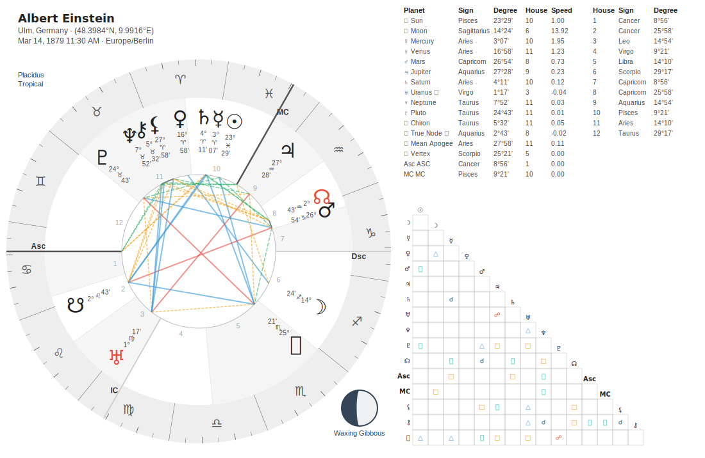
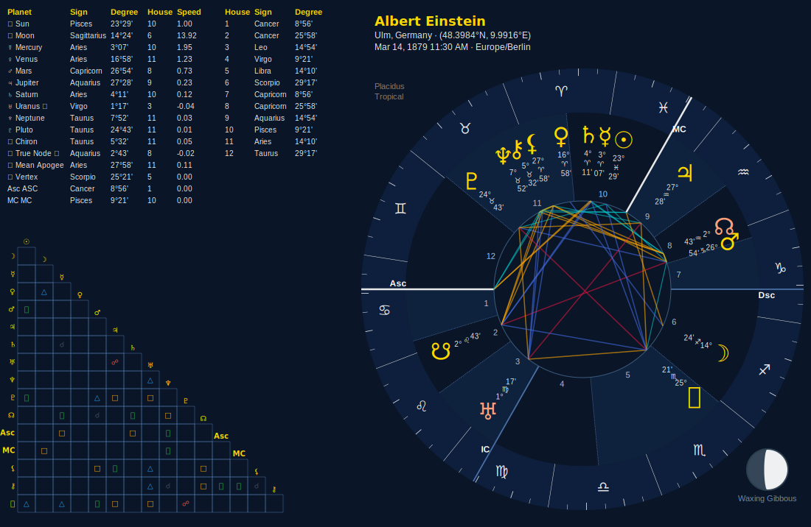
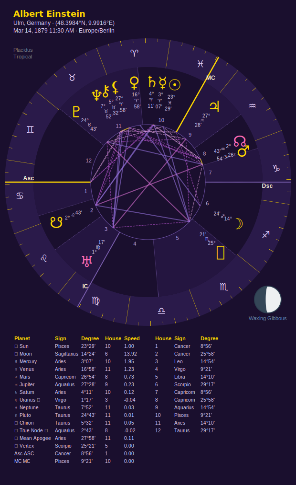

---

## Comparison Charts

Comparison charts (synastry, transits, progressions) use the same API:

```python
from stellium import ComparisonBuilder

comparison = ComparisonBuilder.synastry(chart1, chart2).calculate()

comparison.draw("synastry.svg") \
    .preset_synastry() \
    .with_theme("celestial") \
    .save()
```

The `preset_synastry()` is optimized for relationship charts:

- Moon in corner (saves space)
- Moon label shown (identifies which chart's moon)
- Chart info and aspect counts displayed

---

## Technical Details

### Accessibility

**WCAG AA Compliant:**

- All text has minimum 4.5:1 contrast ratio against backgrounds
- Zodiac wheel glyphs are ALWAYS adaptively colored for readability
- Color is never the only means of conveying information

**Colorblind-Friendly Options:**

- `cividis` theme - optimized for all types of colorblindness
- `viridis` theme - perceptually uniform, colorblind-safe
- `grey` palette - monochrome option

### SVG Output

All charts are rendered as SVG (Scalable Vector Graphics):

- Infinite scalability without quality loss
- Small file sizes (typically 50-200KB)
- Embeddable in web pages, PDFs, presentations
- Editable in tools like Inkscape or Adobe Illustrator

### Performance

Chart rendering is fast (typically <100ms) because:

- Efficient collision detection for planet placement
- Lazy evaluation (only renders when `.save()` is called)
- Optimized SVG generation

### File Organization

Generated SVG files are saved to your specified path:

```python
chart.draw("charts/einstein.svg").save()  # Saves to charts/ directory
chart.draw("/tmp/test.svg").save()        # Saves to /tmp/
chart.draw("chart.svg").save()            # Saves to current directory
```

**Note:** Directories must exist before saving. Stellium does not create directories automatically.

---

## Tips and Best Practices

### Discovery Through Autocomplete

The best way to learn the API is through your IDE's autocomplete:

```python
chart.draw("chart.svg").  # <-- Pause here and see all methods!
```

Every method is documented with type hints and docstrings.

### Start with Presets

Don't overwhelm yourself with options. Start with a preset, then customize:

```python
# Step 1: Start with preset
chart.draw().preset_standard().save()

# Step 2: Add a theme
chart.draw().preset_standard().with_theme("midnight").save()

# Step 3: Customize further
chart.draw() \
    .preset_standard() \
    .with_theme("midnight") \
    .with_chart_info(position="top-left") \
    .save()
```

### Theme + Palette Coordination

Some combinations are designed to work together:

**Perfect Pairings:**

- `midnight` + `rainbow_midnight` (night sky)
- `celestial` + `rainbow_celestial` (cosmic)
- `neon` + `rainbow_neon` (cyberpunk)
- `classic` + `grey` (printer-friendly)
- `dark` + `grey` (dark mode monochrome)

**Mix and Match:**

- Any theme + `grey` (always works)
- `classic`/`dark` + scientific palettes (modern data viz)
- Any theme + `elemental` (educational)

### Printing and Exporting

For printed materials:

```python
# High contrast, monochrome
chart.draw("print.svg") \
    .with_theme("classic") \
    .with_zodiac_palette("grey") \
    .save()
```

For presentations:

```python
# Bold, eye-catching
chart.draw("presentation.svg") \
    .preset_detailed() \
    .with_theme("midnight") \
    .with_zodiac_palette("rainbow_midnight") \
    .save()
```

For accessibility:

```python
# Maximum colorblind-friendliness
chart.draw("accessible.svg") \
    .with_theme("cividis") \
    .save()
```

---

## Examples Gallery

See the [Theme Gallery](THEME_GALLERY.md) and [Palette Gallery](PALETTE_GALLERY.md) for visual examples of every theme and palette combination.

**Generated chart examples available in:** `docs/images/examples/`

---

## Need More Help?

- [Main README](../README.md) - Project overview and installation
- [Theme Gallery](THEME_GALLERY.md) - Visual showcase of all themes
- [Palette Gallery](PALETTE_GALLERY.md) - Visual showcase of all palettes
- [GitHub Issues](https://github.com/katelouie/stellium/issues) - Report bugs or request features
- [GitHub Discussions](https://github.com/katelouie/stellium/discussions) - Ask questions

---

**Happy charting!** ✨

Built with love by astrologers, for astrologers.
