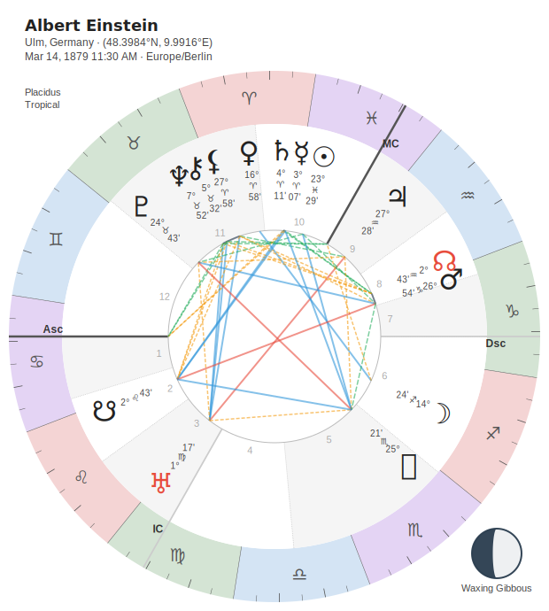

:::{container} st-eyebrow
☾ Orientation map
:::

# For astrologers

:::{container} st-lede
Traditional and modern technique, real chart output, and sensible defaults — so
you can start reading, not configuring.
:::

This page is a **map** to the parts of the docs that matter to practice. No
programming background is assumed.

---

## You don't have to write code

Two ways in before you touch Python at all — and when you're ready for more, the
guide takes you gently.

::::{container} st-grid

:::{container} st-cbcard
**The web app**

Draws charts right in your browser — roughly 50–60% of the library, nothing to
install.

[Open the web app →](https://www.stelliumastro.app/){.st-btn .st-btn-gold}
:::

:::{container} st-cbcard
**Colab notebook**

Runs the real package in the cloud — copy a cell, change the birth data, press play.

[Open in Colab →](https://colab.research.google.com/github/katelouie/stellium/blob/main/examples/stellium_sampler_colab.ipynb){.st-btn}
:::

::::

Prefer the full toolkit on your own machine? `pip install stellium` — see
[the developer's map](for-developers.md) for setup.

---

## Learn the astrology

:::{container} st-panel st-panel-gold
**The Stellium Astrology Guide** — what a house *is*, where quadrant systems came
from, why anyone argues about Placidus, and how a working astrologer actually reads
the thing. Written for the Pythonista who can call `chart.get_houses()` but isn't
sure what they're looking at, and for the astrologer who wants the history under the
keywords.

**Eight of twenty-four chapters are written**, and it says on every page which ones
have been checked against computed output.

[Start the guide →](astrology/README.md){.st-btn .st-btn-gold}
:::

::::{container} st-tiles st-tiles-gold

:::{container} st-tile
[☰]{.st-glyph}

**[00 · Orientation](astrology/guide/00_orientation.md)**

What a chart actually is, and the sky as a set of coordinates.
:::

:::{container} st-tile
[♈]{.st-glyph}

**[01 · The Zodiac](astrology/guide/01_the_zodiac.md)**

Signs, elements, modalities; tropical vs. sidereal.
:::

:::{container} st-tile
[☿]{.st-glyph}

**[02 · Planets & Points](astrology/guide/02_planets_and_points.md)**

Luminaries to outer planets; nodes, Lilith, asteroids, centaurs.
:::

:::{container} st-tile
[⌂]{.st-glyph}

**[03 · Houses](astrology/guide/03_houses.md)**

The twelve places, and the house-division argument. The flagship chapter.
:::

:::{container} st-tile
[△]{.st-glyph}

**[04 · Aspects](astrology/guide/04_aspects.md)**

Major, minor and harmonic; orbs; applying and separating.
:::

:::{container} st-tile
[☉]{.st-glyph}

**[05 · Sect](astrology/guide/05_sect.md)**

The day/night chart — the most under-taught traditional concept.
:::

:::{container} st-tile
[♃]{.st-glyph}

**[06 · Dignity & Rulership](astrology/guide/06_dignity_and_rulership.md)**

Triplicity, bounds, decans, dispositors. **Verified against computed output.**
:::

:::{container} st-tile
[⊕]{.st-glyph}

**[07 · Lots](astrology/guide/07_lots_arabic_parts.md)**

Fortune, Spirit, and the sect-based formula machine. **Verified.**
:::

::::

---

## Charts you can cast

Every major chart form, with the defaults a working astrologer expects.

::::{container} st-tiles st-tiles-gold

:::{container} st-tile
[☉]{.st-glyph}

**[Natal](CHART_TYPES.md)**

The birth chart — the foundation of everything else.
:::

:::{container} st-tile
[☾]{.st-glyph}

**[Synastry & composite](cookbooks/comparison.md)**

Relationship work: bi-wheels, composite and Davison.
:::

:::{container} st-tile
[♃]{.st-glyph}

**[Transits](cookbooks/transit.md)**

The current sky over the natal, with exact aspect timing.
:::

:::{container} st-tile
[♄]{.st-glyph}

**[Returns](cookbooks/returns.md)**

Solar, lunar and planetary returns — relocated if you like.
:::

:::{container} st-tile
[✶]{.st-glyph}

**[Progressions & directions](cookbooks/progressions.md)**

Secondary progressions, solar arc, primary and zodiacal directions.
:::

:::{container} st-tile
[⚸]{.st-glyph}

**[Electional](cookbooks/electional.md)**

Choosing an auspicious time: predicates, intervals, planetary hours.
:::

::::

:::{note}
**No horary yet.** Electional (choosing a time) is here; horary (judging a question
chart) is not implemented — no querent/quesited assignment, no considerations before
judgement. It is planned, and until it exists this page will not pretend otherwise.
:::

---

## Techniques & traditions

Three traditions, and the traditional timing techniques usually locked inside
desktop software.

::::{container} st-grid

:::{container} st-cbcard
**Western**

Tropical, traditional and modern — the deepest coverage, and the default.
:::

:::{container} st-cbcard
**Vedic**

Sidereal, nine ayanamsas, North and South Indian chart styles. [Cookbook →](cookbooks/vedic.md)
:::

:::{container} st-cbcard
**Chinese**

Ba Zi — Four Pillars, Ten Gods, hidden stems. [Cookbook →](cookbooks/bazi.md)
:::

::::

Each of these is a cookbook: a page of worked recipes, every one executed at build
time and showing its real output.

:::{container} st-tags
- [Essential & accidental dignities](cookbooks/dignities.md){.st-tag}
- [Profections](cookbooks/profections.md){.st-tag}
- [Zodiacal Releasing](cookbooks/zodiacal_releasing.md){.st-tag}
- [Hellenistic & lots](cookbooks/hellenistic.md){.st-tag}
- [Primary directions](cookbooks/directions.md){.st-tag}
- [Solar arc directions](cookbooks/arc_directions.md){.st-tag}
- [Uranian dials](cookbooks/dial.md){.st-tag}
- [Aspects & orbs](cookbooks/aspects_and_orbs.md){.st-tag}
- [Graphic ephemeris](cookbooks/ephemeris.md){.st-tag}
:::

---

## A reading, end to end

If you *do* try the code, this is all it takes to cast a named chart and draw it.
Change the name, change the theme — that's the whole loop.

```{code-block} python
:caption: reading.py

from stellium import ChartBuilder

chart = ChartBuilder.from_notable("Frida Kahlo").with_aspects().calculate()

chart.draw("frida.svg").with_theme("celestial").save()
```

---

## Unknown birth time

:::{container} st-callout st-callout-gold
[Honest]{.st-callout-label}

**Stellium reads the layer that survives.** A human-in-the-loop *compare-hypothesis*
workbench recovers **sect** — whether the chart is a day or a night chart — at around
70%, cross-validated. It stops there, and it will not invent a minute-level birth
time, because that is an ill-posed problem: many times fit the evidence equally well,
and a method that returns one of them anyway is hiding the problem rather than solving
it.

Sect is worth recovering on its own. It moves the rulership of the whole chart.

[Read the rectification guide →](astrology/RECTIFICATION.md){.st-btn .st-btn-gold}
:::

---

## Make it beautiful

{{ n_themes }} themes and independently-swappable palettes for the ring, the aspect
lines and the glyphs — so a chart for a client looks the way you want it to.

::::{container} st-strip

:::{container} st-shot

[celestial]{.st-shot-label}
:::

:::{container} st-shot

[classic · elemental]{.st-shot-label}
:::

:::{container} st-shot

[sepia]{.st-shot-label}
:::

:::{container} st-shot

[midnight]{.st-shot-label}
:::

::::

[Browse the full theme & palette galleries →](THEME_GALLERY.md)

---

## Reports & planners

Turn any chart into a sectioned, client-ready document — placements, aspects,
dignities and timing — exported to polished PDF with the fonts embedded, so it looks
the same on someone else's machine. Reports can be rendered in other languages with
`with_locale()` (Simplified Chinese ships in the box). Start with the
[Reports guide](REPORTS.md) or the [report cookbook](cookbooks/report.md).

## On whose authority?

:::{container} st-panel st-panel-gold
Stellium takes sides on questions the tradition genuinely disagrees about — which
term bounds, which planetary years, whether Zodiacal Releasing loops. The methodology
pages say **what we compute, which source it comes from, and where the authorities
part ways** — citing Valens, Ptolemy, Firmicus and Houlding — so you can check our
defaults against your own practice rather than take them on faith.

[Read the methodology →](methodology/README.md){.st-btn .st-btn-gold}
:::

---

:::{container} st-switch
**Building software with it?**
[Switch to the developer's map →](for-developers.md)
:::
