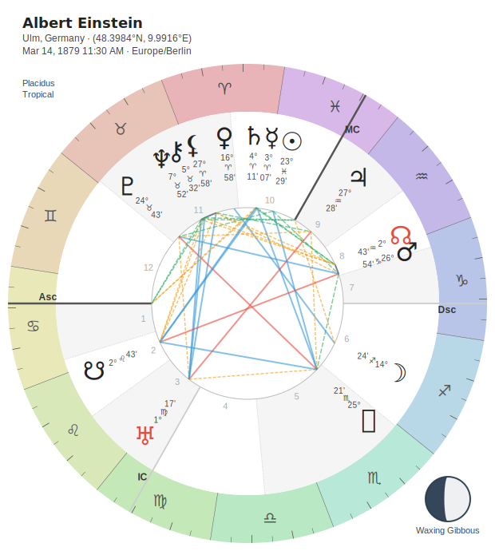
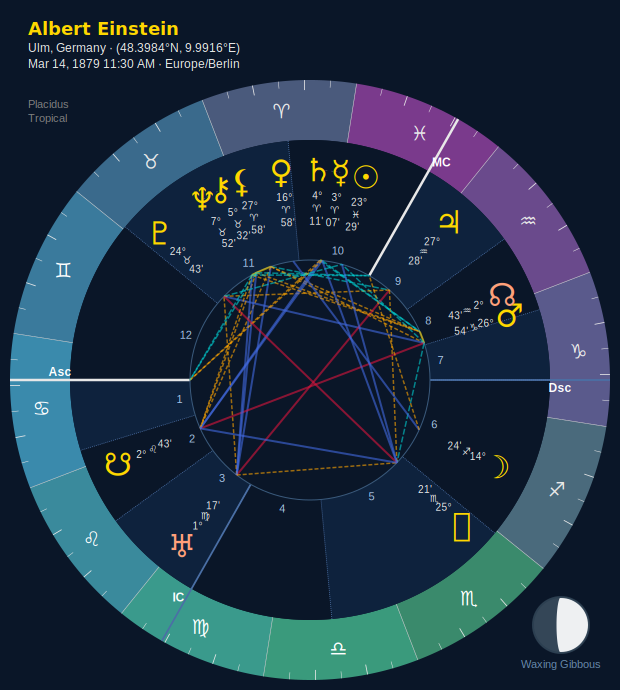
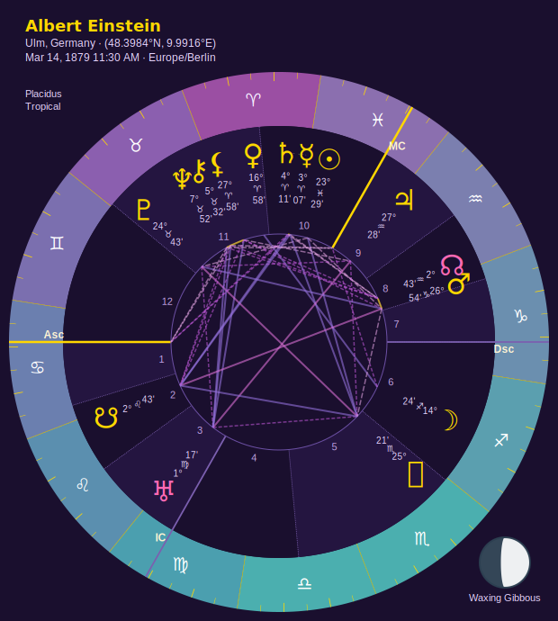
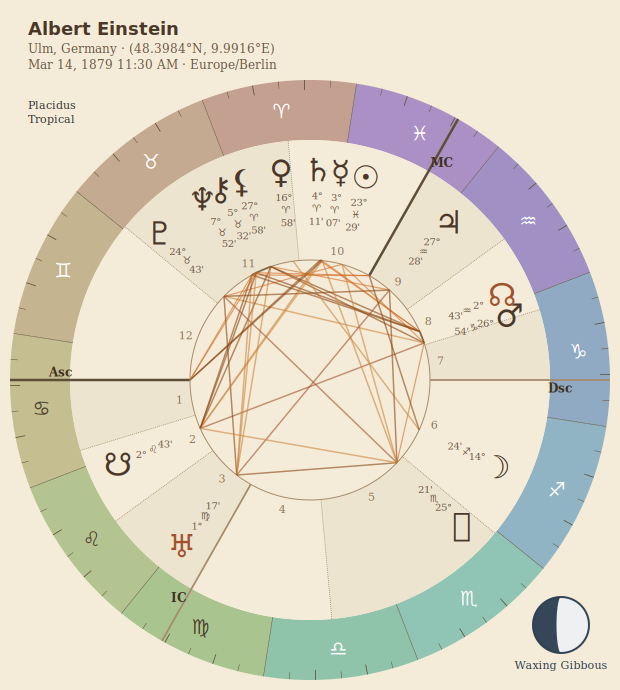

# Computational astrology, composable by design.

:::{container} st-lede
Stellium is an extensible Python library for astrology — a fluent chart builder
you configure like Lego, spanning Western, Vedic and Chinese traditions with the
depth serious practitioners actually need.
:::

:::{container} st-cta
- [`pip install stellium`]{.st-cta-code}
- [Launch the web app →](https://www.stelliumastro.app/){.st-btn .st-btn-primary}
- [Open in Colab](https://colab.research.google.com/github/katelouie/stellium/blob/main/examples/stellium_sampler_colab.ipynb){.st-btn}
:::

:::{container} st-cta-note
No install required — the web app covers roughly 50–60% of the package, and Colab
runs the real thing.
:::

:::::{container} st-split

::::{container} st-split-code
:::{container} st-eyebrow
Two lines of code
:::

```{code-block} python
:caption: first_chart.py

from stellium import ChartBuilder

chart = ChartBuilder.from_notable("Albert Einstein").with_aspects().calculate()
chart.draw("einstein.svg").save()
```
::::

::::{container} st-split-figure
```{image} images/examples/readme_einstein.svg
:alt: Albert Einstein's natal chart, drawn by Stellium
```
::::

:::::

---

## Where do you want to start?

Two honest paths through the same library — pick the one that sounds like you.
Both lead into the same documentation; they just order it differently.

::::{container} st-fork

:::{container} st-card st-card-dev
[⌘]{.st-glyph} **I'm a developer first**

Typed, protocol-driven, composable. Feels familiar if you know React or PyTorch.

- [The developer's map](for-developers.md)
- [Install & first chart](README.md)
- [API Reference](api/index.md)
- [Options & objects](options_list.md)
:::

:::{container} st-card st-card-astro
[☾]{.st-glyph} **I'm an astrologer first**

Traditional and modern techniques, real chart output, sensible defaults out of the box.

- [The astrologer's map](for-astrologers.md)
- [Chart types](CHART_TYPES.md)
- [Theme & palette galleries](THEME_GALLERY.md)
- [Traditional methods & sources](methodology/README.md)
:::

::::

---

## What you can build

From a one-off natal wheel to a batch of {{ n_notables }} charts feeding a research
notebook — the same library, the same objects.

::::{container} st-tiles

:::{container} st-tile
[☉]{.st-glyph}

**[Natal & return charts](cookbooks/chart.md)**

Publication-quality SVG wheels with dignities, fixed stars and Arabic parts — natal,
solar and lunar returns, Vedic squares, Uranian dials.
:::

:::{container} st-tile
[☍]{.st-glyph}

**[Relationship & timing work](cookbooks/comparison.md)**

Synastry, composite and Davison; transit, progression and solar-arc bi-, tri- and
quad-wheels.
:::

:::{container} st-tile
[♃]{.st-glyph}

**[Client-ready reports](cookbooks/report.md)**

Sectioned terminal, Markdown and HTML reports, plus typeset PDFs — with every font
embedded, so they render identically on someone else's machine.
:::

:::{container} st-tile
[⌘]{.st-glyph}

**[Data & research pipelines](cookbooks/analysis.md)**

Serialize any chart to `dict`/JSON, batch thousands into a DataFrame, or feed
structured chart text straight to an LLM.
:::

::::

---

## Composable, not hard-coded

Most astrology libraries hand you one rigid constructor. Stellium hands you a
builder: swap house systems, aspect engines and zodiacs, stack plugin components,
and evaluate lazily — all fully typed.

```{code-block} python
:caption: composable.py

from stellium import ChartBuilder
from stellium.engines import ModernAspectEngine, PlacidusHouses, WholeSignHouses
from stellium.components import ArabicPartsCalculator

chart = (ChartBuilder.from_details("2000-01-06 12:00", "Seattle, WA")
    .with_house_systems([PlacidusHouses(), WholeSignHouses()])   # multiple at once
    .with_aspects(ModernAspectEngine())                          # swap the engine
    .add_component(ArabicPartsCalculator())                      # stack plugins
    .calculate())                                                # nothing ran until here
```

Positions come from Swiss Ephemeris. Every asteroid and trans-Neptunian body in the
registry is cross-checked against NASA JPL Horizons in the test suite, so a body
named Hygiea is *the* Hygiea. Output is portable SVG / PDF / PNG with every font
bundled, so charts render identically everywhere.

---

## Breadth most libraries skip

Three traditions, and the traditional timing techniques that are usually locked
inside desktop software — not scattered across half a dozen half-maintained packages.

:::{container} st-tags
- [Western]{.st-tag .st-tag-lead}
- [Vedic · 9 ayanamsas]{.st-tag .st-tag-lead}
- [Chinese · Ba Zi]{.st-tag .st-tag-lead}
- [Synastry]{.st-tag}
- [Transits]{.st-tag}
- [Composite & Davison]{.st-tag}
- [Returns]{.st-tag}
- [Progressions]{.st-tag}
- [Solar arc directions]{.st-tag}
- [Profections]{.st-tag}
- [Firdaria]{.st-tag}
- [Zodiacal Releasing]{.st-tag}
- [Essential & accidental dignities]{.st-tag}
- [Fixed stars]{.st-tag}
- [Arabic parts]{.st-tag}
- [Uranian dials]{.st-tag}
- [Declinations & OOB]{.st-tag}
- [Primary directions]{.st-tag}
- [Electional]{.st-tag}
- [Length of life (hyleg → alcocoden)]{.st-tag}
:::

See the [chart-type catalog](CHART_TYPES.md) and the [options reference](options_list.md)
for everything, with signatures.

---

## Installation & requirements

One command. Every dependency — `pyswisseph`, `pytz`, `geopy`, `rich`, `svgwrite`,
`typst` — is pulled in automatically, and the Swiss Ephemeris data ships **inside the
wheel**, so there is nothing to download and no `PATH` to configure.

```{code-block} bash
:caption: shell

pip install stellium
```

:::{container} st-pills
- Python 3.11+
- macOS · Linux · Windows
- ephemeris bundled
- PDF export included
- no API keys
:::

The astronomy runs with no network at all. The one exception is geocoding: passing a
*place name* looks it up over the network, while passing coordinates does not — see
[Locations & time](LOCATIONS.md).

---

## Learn by cookbook

{{ n_cookbooks }} runnable cookbooks holding **{{ n_recipes }} recipes** — each one a
focused mini-tutorial you can copy, run and adapt. Every recipe on those pages is a
real function in a real script, executed at build time, showing its **actual output**.

::::{container} st-grid

:::{container} st-cbcard
[Chart Visualization](cookbooks/chart.md) [{{ cb_chart }}]{.st-n}

Themes, palettes, house systems, tables.
:::

:::{container} st-cbcard
[Electional Astrology](cookbooks/electional.md) [{{ cb_electional }}]{.st-n}

Auspicious timing, predicates, planetary hours.
:::

:::{container} st-cbcard
[Profections](cookbooks/profections.md) [{{ cb_profections }}]{.st-n}

Annual and monthly profections for many points.
:::

:::{container} st-cbcard
[MultiChart](cookbooks/multichart.md) [{{ cb_multichart }}]{.st-n}

Synastry, transits, bi-, tri- and quad-wheels.
:::

:::{container} st-cbcard
[BaZi (Four Pillars)](cookbooks/bazi.md) [{{ cb_bazi }}]{.st-n}

Four Pillars, Ten Gods, hidden stems, elements.
:::

:::{container} st-cbcard
[Reports](cookbooks/report.md) [{{ cb_report }}]{.st-n}

Terminal reports, PDF generation, batches.
:::

::::

[Browse all {{ n_cookbooks }} cookbooks →](cookbooks/index.md)

---

## The complete API reference

:::{container} st-panel
Every class, method and signature — generated from source, so it is the single
source of truth for the whole package. If it isn't in a guide, it's here.

[Open the API Reference →](api/index.md){.st-btn .st-btn-primary}
:::

---

## One chart, {{ n_themes }} themes

Restyle a whole wheel by swapping one argument — `.with_theme(...)`. Backgrounds,
zodiac rings, aspect lines and glyphs all follow. There are {{ n_palettes }} palettes
on top of that.

::::{container} st-strip

:::{container} st-shot

[classic]{.st-shot-label}
:::

:::{container} st-shot

[midnight]{.st-shot-label}
:::

:::{container} st-shot

[celestial]{.st-shot-label}
:::

:::{container} st-shot

[sepia]{.st-shot-label}
:::

::::

[See all themes & palettes →](THEME_GALLERY.md)

---

## Project & community

::::{container} st-tiles

:::{container} st-tile
[⌥]{.st-glyph}

**[Source on GitHub](https://github.com/katelouie/stellium)**

Issues, discussions, and the [contributing guide](https://github.com/katelouie/stellium/blob/main/CONTRIBUTING.md).
:::

:::{container} st-tile
[❋]{.st-glyph}

**[Changelog](https://github.com/katelouie/stellium/blob/main/CHANGELOG.md)**

What's new in v{{ version }}, and the release history.
:::

:::{container} st-tile
[❞]{.st-glyph}

**[Citing Stellium](https://github.com/katelouie/stellium/blob/main/CITATION.cff)**

How to reference the library in research — GitHub's *Cite this repository* reads it.
:::

:::{container} st-tile
[◑]{.st-glyph}

**[Colour & theme reference](starlight_colors.html)**

Every theme, palette and hex value, on one interactive page.
:::

::::

Licensed **AGPL-v3** · built and maintained by
[Kate Louie](https://github.com/katelouie) · ephemeris data © Astrodienst
(Swiss Ephemeris).

```{toctree}
:hidden:
:caption: Start Here
:maxdepth: 1

Overview <README>
For developers <for-developers>
For astrologers <for-astrologers>
```

```{toctree}
:hidden:
:caption: Guides
:maxdepth: 1

Visualization <VISUALIZATION>
Reports <REPORTS>
Chart Types <CHART_TYPES>
Rectification <astrology/RECTIFICATION>
Locations <LOCATIONS>
Diagnostics <DIAGNOSTICS>
```

```{toctree}
:hidden:
:caption: The Astrology Guide
:maxdepth: 2

Introduction <astrology/README>
```

```{toctree}
:hidden:
:caption: Cookbooks
:maxdepth: 1

cookbooks/index
```

```{toctree}
:hidden:
:caption: Reference
:maxdepth: 1

API Reference <api/index>
Options & Objects <options_list>
Accidental Dignity <api/accidental_dignity_structure>
```

```{toctree}
:hidden:
:caption: Methodology & Sources
:maxdepth: 1

Traditional Methods & Sources <methodology/README>
Planetary Years <methodology/research/planetary-years>
Zodiacal Releasing <methodology/research/zodiacal-releasing>
Firdaria <methodology/research/firdaria>
```

```{toctree}
:hidden:
:caption: Galleries
:maxdepth: 1

Themes <THEME_GALLERY>
Palettes <PALETTE_GALLERY>
```
